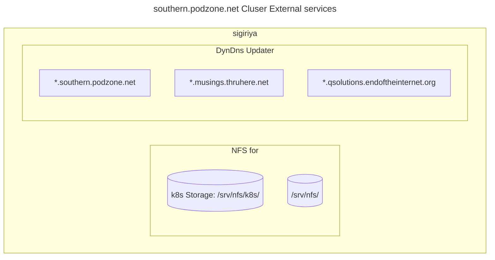

# External Services

```mermaid
---
title: southern.podzone.net Cluser External services
---
graph TD
subgraph  sigiriya
  subgraph NFS for 
    nfs-service1[(k8s Storage: /srv/nfs/k8s/)]
    nfs-service[(/srv/nfs/)]
  end
  subgraph DynDns Updater
    *.southern.podzone.net
    *.musings.thruhere.net
    *.qsolutions.endoftheinternet.org
  end
end
```
