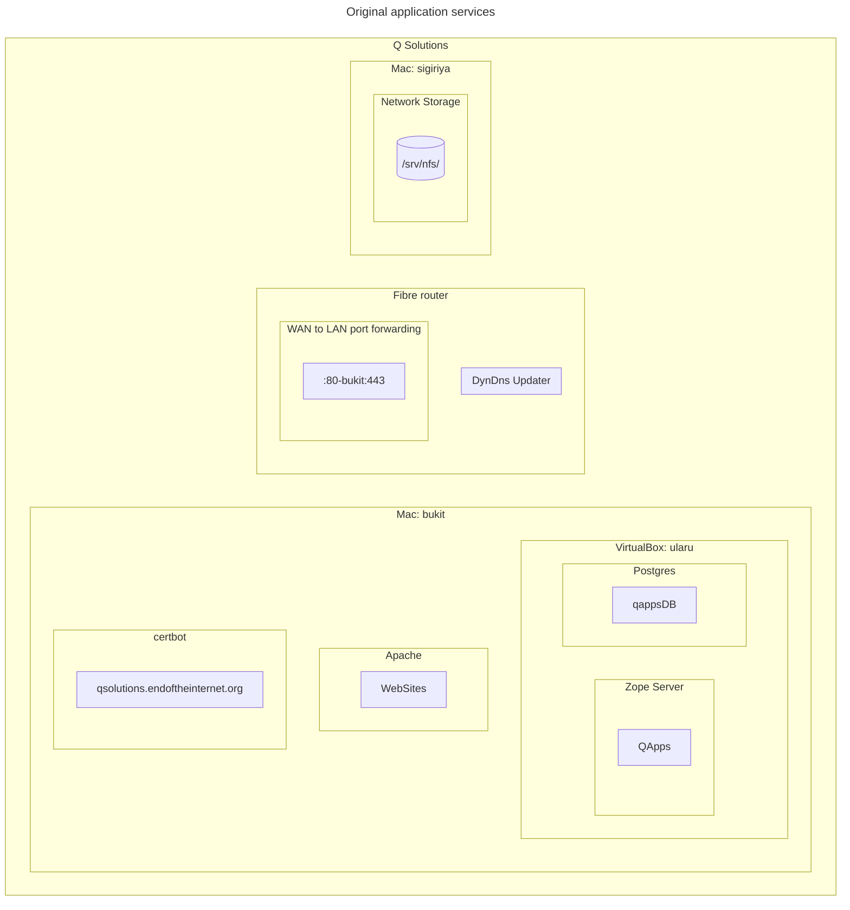
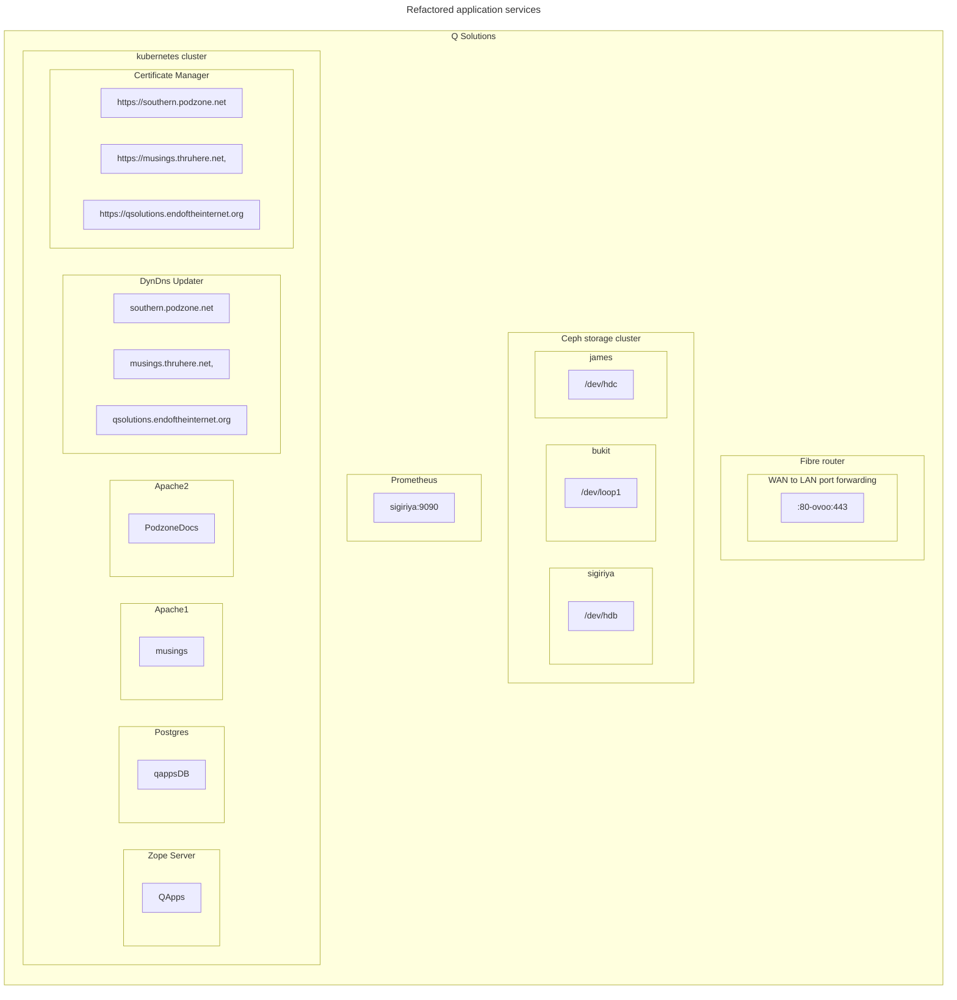

# External Services

Non functional services requirements are as follows:

1. Storage
1. Internet ingress
1. Application container
1. Database
1. Internet name service (DNS)
1. Certificate for https

These are currently provisioned as follows

1. Storage is supplied to the network using a NFS server, sigiriya
1. Internet ingress is implemented using fibre router port forwarding to multiple internal network IP:Port listeners
1. The application container is Zope, running in a VirtualBox host on mac host bukit
1. The database is Postgres, running in a VirtualBox host on mac host bukit
1. Updating of the DynDns host to IP mappings is managed by the fibre router
1. The https certificate is managed using certbot on bukit

There are a number of these services that are implemented in such a way that they represent a single point of failure. This is not avoidable in the case of functionality provided by the fibre router. All other services can be highly available.

The following changes are required:

1. Migrate from NFS to distributed storage. Ceph has been selected
2. Internet ingress fan-out will be handled by the k8s cluster. The router will only forward ports 80 and 443 to the cluster lbr (ovoo)
3. Zope to be packaged and managed using k8s
4. Postgres packaging for k8s
5. Since multiple hosts IP mappings are required, and the fibre router being limited to one host update, this function moves out of the router. Ideally packaged for k8s.
6. Kubernetes Certificate Manager to be used to update https certificates

