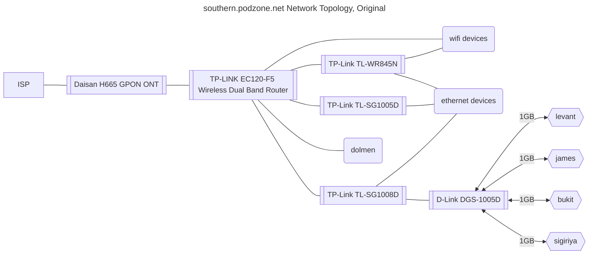
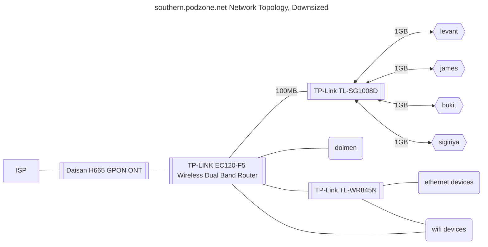
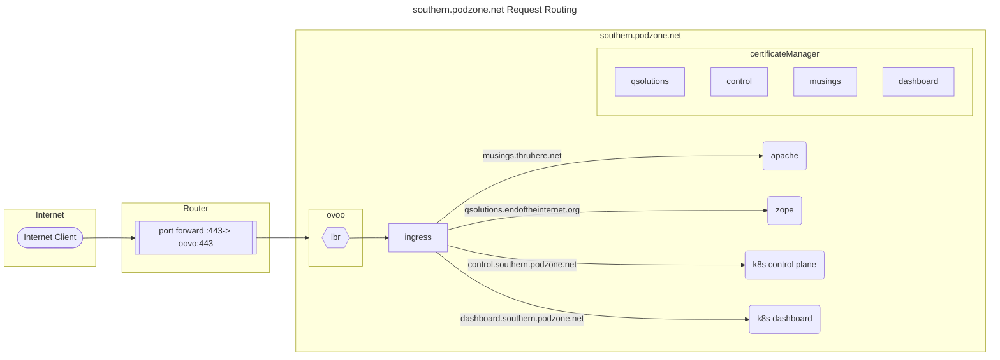
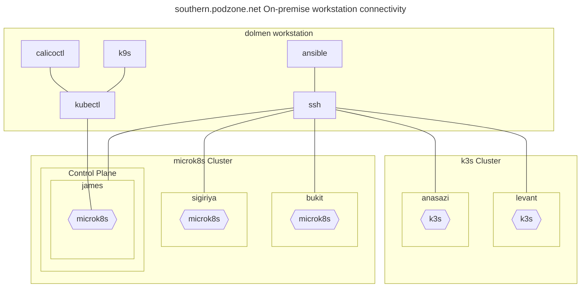
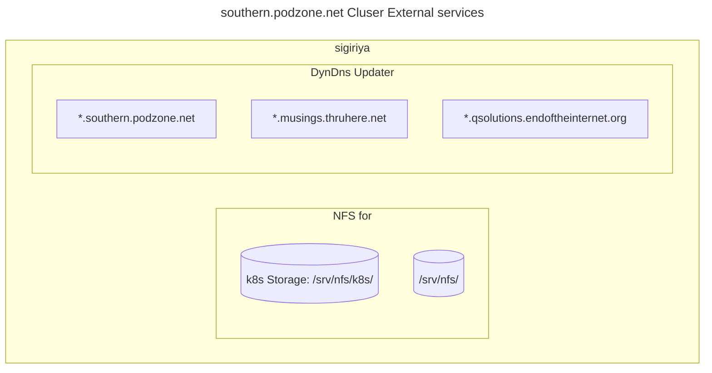

# southern.podzone.net 

## Architecture: southern.podzone.net

```mermaid
---
title: southern.podzone.net Network Topology, Original
---
graph LR

ISP --- ont
ont --- router
router --- switch2
router ---switch3
router --- ap1
router --- other2
router --- workstation
ap1 --- other1
ap1 --- other2
switch2 --- other1
switch3 --- switch1
switch3 --- other1
switch1 <-->|1GB| k8s1
switch1 <-->|1GB| k8s2
switch1 <-->|1GB| k8s3
switch1 <-->|1GB| k8s4

ont[[Daisan H665 GPON ONT]]
router[[TP-LINK EC120-F5 Wireless Dual Band Router]]
switch1[[D-Link DGS-1005D]]
switch2[[TP-Link TL-SG1005D]]
switch3[[TP-Link TL-SG1008D]]
ap1[[TP-Link TL-WR845N]]
other1(ethernet devices)
other2(wifi devices)
k8s1{{levant}}
k8s2{{james}}
k8s3{{bukit}}
k8s4{{sigiriya}}
workstation(dolmen)
```

```mermaid
---
title: southern.podzone.net Network Topology, Downsized
---
graph LR

ISP --- ont
ont --- router
router ---|100MB| switch1

router --- workstation
router --- ap1
router --- other2

switch1 <-->|1GB| k8s1
switch1 <-->|1GB| k8s2
switch1 <-->|1GB| k8s3
switch1 <-->|1GB| k8s4

ap1 --- other1
ap1 --- other2

ont[[Daisan H665 GPON ONT]]
router[[TP-LINK EC120-F5 Wireless Dual Band Router]]
switch1[[TP-Link TL-SG1008D]]
ap1[[TP-Link TL-WR845N]]
other1(ethernet devices)
other2(wifi devices)
k8s1{{levant}}
k8s2{{james}}
k8s3{{bukit}}
k8s4{{sigiriya}}
workstation(dolmen)
```

```mermaid
---
title: southern.podzone.net Request Routing
---
graph LR

clientExt1 --> routerPort1
routerPort1 --> ovoo
lbr --> ingress

ingress -->|musings.thruhere.net| app1
ingress -->|qsolutions.endoftheinternet.org| app4
ingress -->|control.southern.podzone.net| app2
ingress -->|dashboard.southern.podzone.net| app3

  subgraph Internet
    clientExt1([Internet Client])
  end
  subgraph Router
    routerPort1[[port forward :443-> oovo:443]]
  end
  subgraph southern.podzone.net
    subgraph certificateManager
      qsolutions
      control
      musings
      dashboard
    end
    subgraph ovoo
      lbr{{lbr}}
    end
    ingress
    app1(apache)
    app4(zope)
    app2(k8s control plane)
    app3(k8s dashboard)

  end
```

```mermaid
---
title: southern.podzone.net On-premise workstation connectivity
---
graph TD
 
kubectl --- microk8sW2
calicoctl --- kubectl

k9s --- kubectl
ssh --- james
ssh --- sigiriya
ssh --- bukit
ssh --- anasazi
ssh --- levant

ansible --- ssh

      subgraph dolmen workstation
        kubectl
        calicoctl
        ssh
        k9s
        ansible
      end

      subgraph microk8s Cluster
        subgraph Control Plane
          subgraph james
            microk8sW2{{microk8s}}
          end
        end
        subgraph sigiriya
          microk8sW1{{microk8s}}
        end
        subgraph bukit
          microk8sC2{{microk8s}}
        end
      end
      
      subgraph k3s Cluster
        subgraph levant
          k3s1{{k3s}}
        end
        subgraph anasazi
          k3s2{{k3s}}
        end
      end
```

```mermaid
---
title: southern.podzone.net Cluser External services
---
graph TD
subgraph  sigiriya
  subgraph NFS for 
    nfs-service1[(k8s Storage: /srv/nfs/k8s/)]
    nfs-service[(/srv/nfs/)]
  end
  subgraph DynDns Updater
    *.southern.podzone.net
    *.musings.thruhere.net
    *.qsolutions.endoftheinternet.org
  end
end
```
