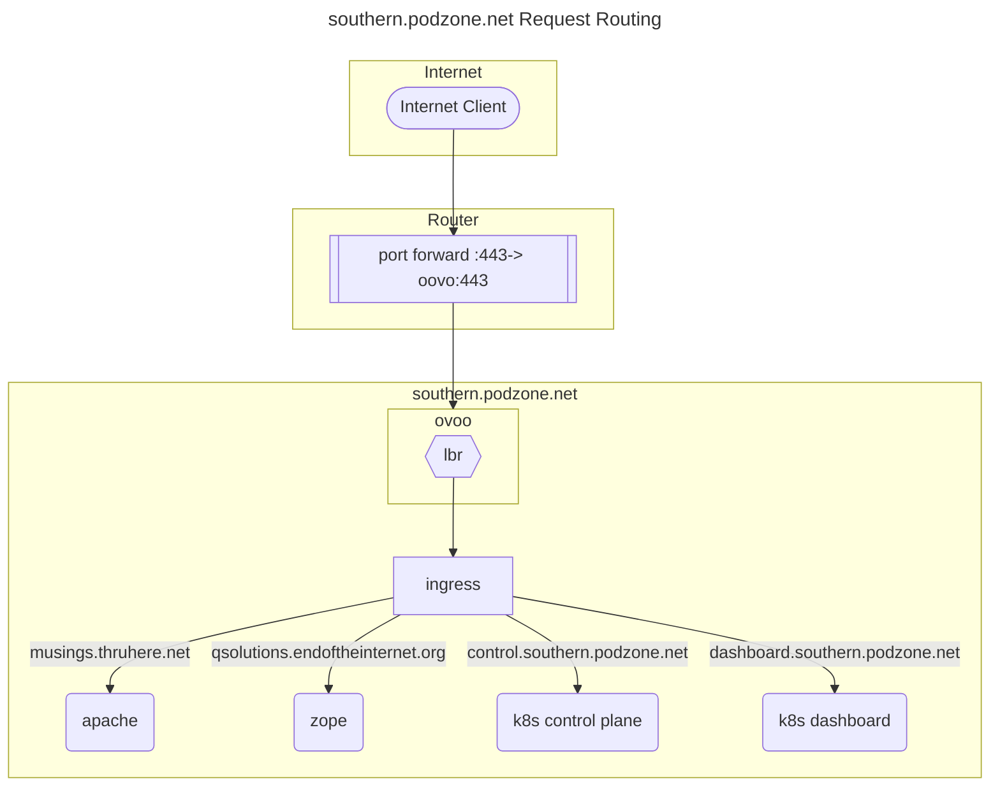

# Ingress

```mermaid
---
title: southern.podzone.net Request Routing
---
graph TD

clientExt1 --> routerPort1
routerPort1 --> ovoo
lbr --> ingress

ingress -->|musings.thruhere.net| app1
ingress -->|qsolutions.endoftheinternet.org| app4
ingress -->|control.southern.podzone.net| app2
ingress -->|dashboard.southern.podzone.net| app3

  subgraph Internet
    clientExt1([Internet Client])
  end
  subgraph Router
    routerPort1[[port forward :443-> oovo:443]]
  end
  subgraph southern.podzone.net
 
    subgraph ovoo
      lbr{{lbr}}
    end
    ingress
    app1(apache)
    app4(zope)
    app2(k8s control plane)
    app3(k8s dashboard)

  end
```
