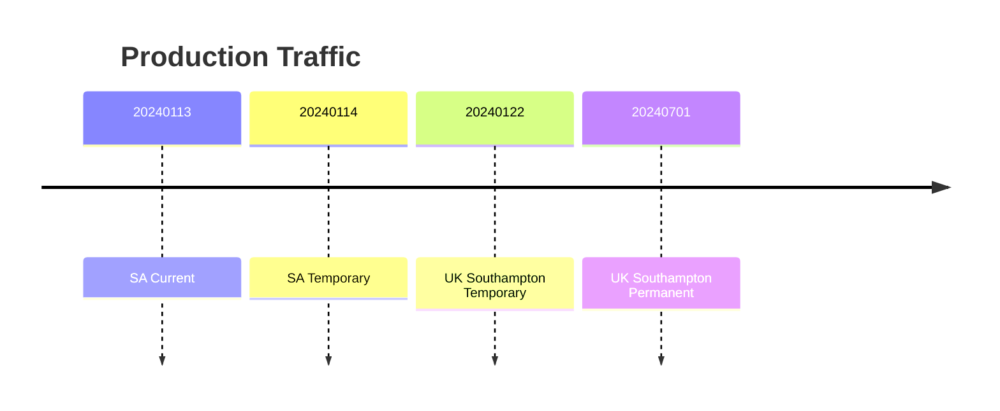

# Site Inventory

## South Africa (SA)

### SA: Current Main

High Availability is achieved with k8s and ceph HA clustering.

- Shut Down #1: Node 1 Pack for UK: Before 20240113
- Shut Down #2: Node 2 Pack for UK: Before 20240113
- Shut Down #2: Node 3 Pack for UK: Before 20240116 12pm

### SA: Temporary Main Site, no High Availability

Availability: Single node k8s, no ceph

- Start Up: Before 20240113
- Shut Down: After 20240120

## United Kingdom (UK)

High availability: k8s and ceph

- Start Up #1: Nodes 3 and 4: After 20240116
- Start Up #2: Node 1: After 20240119

