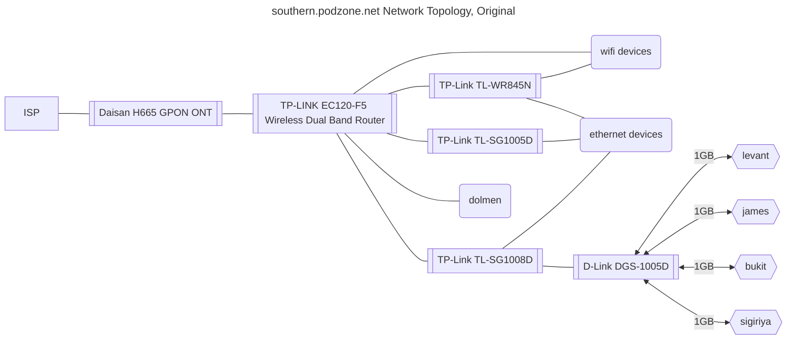
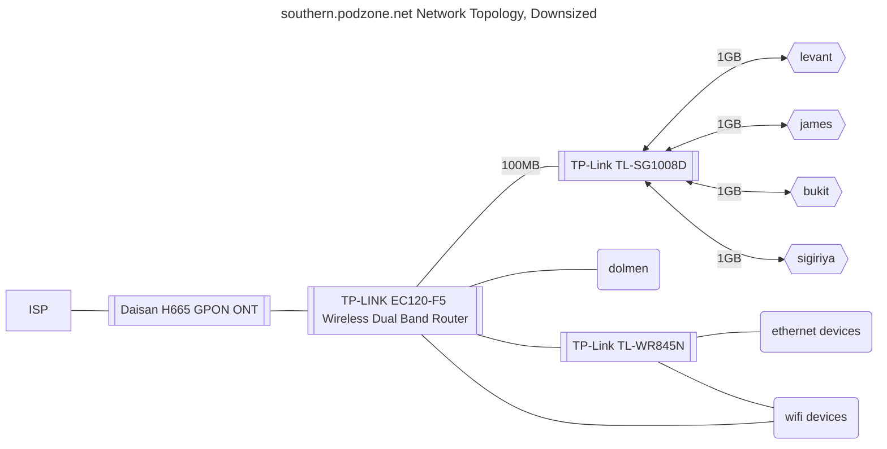

# Network Topology

```mermaid
---
title: southern.podzone.net Network Topology, Original
---
graph LR

ISP --- ont
ont --- router
router --- switch2
router ---switch3
router --- ap1
router --- other2
router --- workstation
ap1 --- other1
ap1 --- other2
switch2 --- other1
switch3 --- switch1
switch3 --- other1
switch1 <-->|1GB| k8s1
switch1 <-->|1GB| k8s2
switch1 <-->|1GB| k8s3
switch1 <-->|1GB| k8s4

ont[[Daisan H665 GPON ONT]]
router[[TP-LINK EC120-F5 Wireless Dual Band Router]]
switch1[[D-Link DGS-1005D]]
switch2[[TP-Link TL-SG1005D]]
switch3[[TP-Link TL-SG1008D]]
ap1[[TP-Link TL-WR845N]]
other1(ethernet devices)
other2(wifi devices)
k8s1{{levant}}
k8s2{{james}}
k8s3{{bukit}}
k8s4{{sigiriya}}
workstation(dolmen)
```

```mermaid
---
title: southern.podzone.net Network Topology, Downsized
---
graph LR

ISP --- ont
ont --- router
router ---|100MB| switch1

router --- workstation
router --- ap1
router --- other2

switch1 <-->|1GB| k8s1
switch1 <-->|1GB| k8s2
switch1 <-->|1GB| k8s3
switch1 <-->|1GB| k8s4

ap1 --- other1
ap1 --- other2

ont[[Daisan H665 GPON ONT]]
router[[TP-LINK EC120-F5 Wireless Dual Band Router]]
switch1[[TP-Link TL-SG1008D]]
ap1[[TP-Link TL-WR845N]]
other1(ethernet devices)
other2(wifi devices)
k8s1{{levant}}
k8s2{{james}}
k8s3{{bukit}}
k8s4{{sigiriya}}
workstation(dolmen)
```
