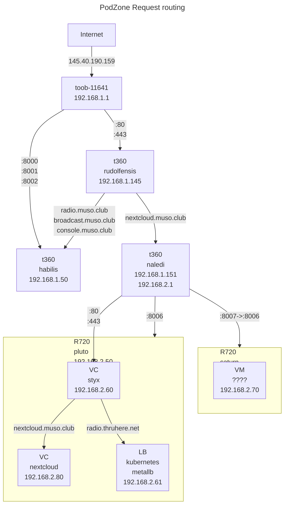

# Data Centre

Management considerations when scale and scope are encountered in technical implementation.

## Network Architecture

### DHCP and IP allocation

- Toob Network: 192.168.1.0/24
- PodZone IPs: 192.168.2.0/24



## Platform configuration

## NetPlan

- Modify `/etc/netplan/00-installer-config.yaml` for static IPs. See yaml below.
- Generate configuration: `sudo netplan generate`
- Apply configuration: `sudo netplan apply`
```yaml

# /etc/netplan/00-installer-config.yaml
# Netplan for pluto
network:
  ethernets:
    eno1:
      addresses:
        - 192.168.2.1/24
      nameservers:
        addresses: 
          - 8.8.8.8
      routes:
        - to: default
          via: 192.168.2.10
    eno2:
      addresses:
        - 192.168.2.2/24
    eno3:
      addresses:
        - 192.168.2.3/24
    eno4:
      addresses:
        - 192.168.2.4/24
  version: 2
```

## lxd

- lxd installed standard on ubuntu server 22.04
- Initialise: `lxd init`

## maas

- `sudo snap install --channel=3.5 maas`
- `sudo snap install maas-test-db`
- `sudo systemctl disable --now systemd-timesyncd`
- `sudo maas init region+rack --database-uri maas-test-db:///`
- `sudo maas createadmin --username=colleymj --email=martinjcolley@gmail.com`
- Access GUI, set NS to `8.8.8.8`, and proxy to `http://192.168.1.145:3128`

## Unit configuration

- Bare metal management: maas
- VM Management: LXD
- OS install: PXE
- Snap install: cloud-init

### Proxy

- At scale, artefacts from the internet typically used in a unit build can be cached with obvious benefit. I addition, when evaluating software, uninstallation to get a known good state for re-install is very efficient when cached apt, vm and snap packages are used.
- In the podnet norham installation, rudolfensis - `192.168.1.145:3128` - is used for the caching proxy.
- Install: `sudo apt-get install squid`
- Unit config: Add entries in `/etc/environment`, and `/etc/bash.bashrc`
  
```bash
export https_proxy=http://192.168.1.145:3128
export http_proxy=http://192.168.1.145:3128
export ftp_proxy=ftp://192.168.1.145:3128
```

- Unit config: Add entries in `/etc/apt/apt.conf`:

```bash
Acquire::http::proxy  "http://192.168.1.145:3128/";
Acquire::ftp::proxy "ftp://192.168.1.145:3128/";
Acquire::https::proxy "https://192.168.1.145:3128/";
```

- Snap:

```bash
snap set system proxy.http="http://192.168.1.145:3128"
snap set system proxy.https="http://192.168.1.145:3128"
```

## Router

- Strategy: Add a dedicated t630, using wifi as 'WAN' interface, and enp1s0 as LAN NAT gateway.
- Strategy: Use port forwarding to access specific services on LAN from WAN.
- Use t630 `antecessor`, install Ubuntu server using wi-fi connection
- Netplan: Set up `enp1s0` with static IP `192.168.2.10`
- Clients: Set `192.168.2.10` as gateway
- Enable IP forwarding in the kernel: uncomment `#net.ipv4.ip_forward=1` in `/etc/sysctl.conf`
- To test: `echo 1 > /proc/sys/net/ipv4/ip_forward`, which is lost on system restart
- Support persistent IP tables: `apt install iptables-persistent`
- NAT: `iptables -t nat -A POSTROUTING -s 192.168.2.0/24 -o wlp2s0 -j MASQUERADE`
- Save changes to persistent tables: `sudo iptables-save > /etc/iptables/rules.v4`
- For ssh: `iptables -t nat -A PREROUTING -i wlp2s0 -p tcp --dport 2222 -j DNAT --to-destination 192.168.2.1:22`
- For maas: `iptables -t nat -A PREROUTING -i wlp2s0 -p tcp --dport 5240 -j DNAT --to-destination 192.168.2.1:5240`
- For lxd: `iptables -t nat -A PREROUTING -i wlp2s0 -p tcp --dport 8843 -j DNAT --to-destination 192.168.2.51:8843`
- Check the rules: `iptables -t nat -nvL`
- Save the rules: `iptables-save > /etc/iptables/rules.v4`

## IPMI

- Fan control: `sudo ipmitool raw 0x30 0x30 0x01 0x00`
- Set fan speed: `sudo ipmitool raw 0x30 0x30 0x02 0xff 0x14`

## Config Method automation options

- Use cloud config to install git and ansible
- Use cloud init ansible package to pull config from git
- Create repo <https://github.com/MoTTTT/podnode.git>
- Create ansible playbook `podnode.yaml`

```yaml
#cloud-config
ansible:
  package_name: ansible-core
  install_method: distro
  pull:
    url: https://github.com/MoTTTT/podnode.git
    playbook_name: podnode.yaml
```

## ProxMox ansible

- Token: `d8d9e43c-fcdf-4dfd-83d3-1b2cdcb528ac`

## Proxmox cloudinit

- `wget https://cloud-images.ubuntu.com/jammy/current/jammy-server-cloudimg-amd64.img` 
- `qm create 9000 --memory 2048 --net0 virtio,bridge=vmbr0 --scsihw virtio-scsi-pci`