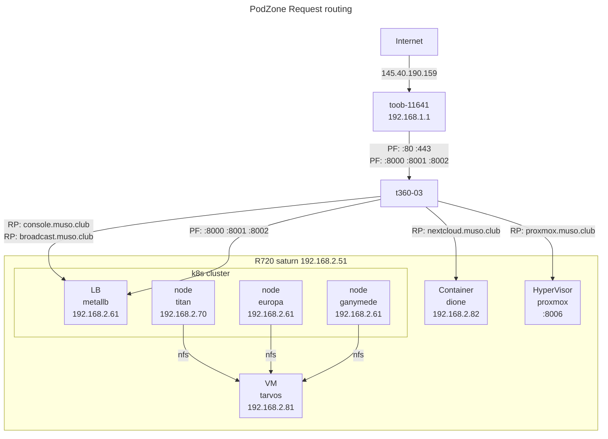

# Data Centre

Management considerations when scale and scope are encountered in technical implementation.

## Network Architecture

### DHCP and IP allocation

- Toob Network: 192.168.1.0/24
- PodZone IPs: 192.168.2.0/24



## Platform configuration

## NetPlan

- Modify `/etc/netplan/00-installer-config.yaml` for static IPs. See yaml below.
- Generate configuration: `sudo netplan generate`
- Apply configuration: `sudo netplan apply`

```yaml
# /etc/netplan/00-installer-config.yaml
# Netplan for pluto
network:
  ethernets:
    eno1:
      addresses:
        - 192.168.2.1/24
      nameservers:
        addresses: 
          - 8.8.8.8
      routes:
        - to: default
          via: 192.168.2.10
    eno2:
      addresses:
        - 192.168.2.2/24
    eno3:
      addresses:
        - 192.168.2.3/24
    eno4:
      addresses:
        - 192.168.2.4/24
  version: 2
```

## lxd

- lxd installed standard on ubuntu server 22.04
- Initialise: `lxd init`

## maas

- `sudo snap install --channel=3.5 maas`
- `sudo snap install maas-test-db`
- `sudo systemctl disable --now systemd-timesyncd`
- `sudo maas init region+rack --database-uri maas-test-db:///`
- `sudo maas createadmin --username=colleymj --email=martinjcolley@gmail.com`
- Access GUI, set NS to `8.8.8.8`, and proxy to `http://192.168.1.145:3128`

## Unit configuration

- Bare metal management: maas
- VM Management: LXD
- OS install: PXE
- Snap install: cloud-init
- Set time-zone: `sudo timedatectl set-timezone Europe/London`
- For dynamic nfs provisioning: `sudo apt install nfs-common`


### Proxy

- At scale, artefacts from the internet typically used in a unit build can be cached with obvious benefit. I addition, when evaluating software, uninstallation to get a known good state for re-install is very efficient when cached apt, vm and snap packages are used.
- In the podnet norham installation, rudolfensis - `192.168.1.145:3128` - is used for the caching proxy.
- Install: `sudo apt-get install squid`
- Unit config: Add entries in `/etc/environment`, and `/etc/bash.bashrc`

### For proxy on naledi

For `/etc/environment`:

```bash
https_proxy=http://192.168.2.1:3128
http_proxy=http://192.168.2.1:3128
ftp_proxy=ftp://192.168.2.1:3128
no_proxy=10.0.0.0/8,192.168.0.0/16,127.0.0.1,172.16.0.0/16,.svc,localhost
```


For `/etc/bash.bashrc`:

```bash
export https_proxy=http://192.168.2.1:3128
export http_proxy=http://192.168.2.1:3128
export ftp_proxy=ftp://192.168.2.1:3128
export no_proxy=10.0.0.0/8,192.168.0.0/16,127.0.0.1,172.16.0.0/16,.svc,localhost
```

- In `/etc/apt/apt.conf`:

```conf
Acquire::http::proxy  "http://192.168.2.1:3128/";
Acquire::ftp::proxy "ftp://192.168.2.1:3128/";
Acquire::https::proxy "http://192.168.2.1:3128/";
```

- Snap:

```bash
snap set system proxy.http="http://192.168.2.1:3128"
snap set system proxy.https="http://192.168.2.1:3128"

### For proxy on rudolfensis

```bash
export https_proxy=http://192.168.1.145:3128
export http_proxy=http://192.168.1.145:3128
export ftp_proxy=ftp://192.168.1.145:3128
```

- Unit config: Add entries in `/etc/apt/apt.conf`:

```bash
Acquire::http::proxy  "http://192.168.1.145:3128/";
Acquire::ftp::proxy "ftp://192.168.1.145:3128/";
Acquire::https::proxy "http://192.168.1.145:3128/";
```

- Snap:

```bash
snap set system proxy.http="http://192.168.1.145:3128"
snap set system proxy.https="http://192.168.1.145:3128"
```

## Router

- Strategy: Add a dedicated t630, using wifi as 'WAN' interface, and enp1s0 as LAN NAT gateway.
- Strategy: Use port forwarding to access specific services on LAN from WAN.
- Use t630 `antecessor`, install Ubuntu server using wi-fi connection
- Netplan: Set up `enp1s0` with static IP `192.168.2.10`
- Clients: Set `192.168.2.10` as gateway
- Enable IP forwarding in the kernel: uncomment `#net.ipv4.ip_forward=1` in `/etc/sysctl.conf`
- To test: `echo 1 > /proc/sys/net/ipv4/ip_forward`, which is lost on system restart
- Support persistent IP tables: `apt install iptables-persistent`
- NAT: `iptables -t nat -A POSTROUTING -s 192.168.2.0/24 -o wlp2s0 -j MASQUERADE`
- ProxMox: `iptables -t nat -A PREROUTING -i wlp2s0 -p tcp --dport 8006 -j DNAT --to-destination 192.168.2.51:8006`
- Icecast: `iptables -t nat -A PREROUTING -i wlp2s0 -p tcp --dport 8000 -j DNAT --to-destination 192.168.2.61:8000`
- Libretime 1: `iptables -t nat -A PREROUTING -i wlp2s0 -p tcp --dport 8001 -j DNAT --to-destination 192.168.2.61:8001`
- Libretime 2: `iptables -t nat -A PREROUTING -i wlp2s0 -p tcp --dport 8002 -j DNAT --to-destination 192.168.2.61:8002`
- k8s cluster: `iptables -t nat -A PREROUTING -i wlp2s0 -p tcp --dport 16443 -j DNAT --to-destination 192.168.2.70:16443`
- Check the rules: `iptables -t nat -nvL`
- Save the rules: `iptables-save > /etc/iptables/rules.v4`
- List rules, with line numbers: `iptables -t nat -nvL --line-numbers`

## Cluster registry

- Spegel stateless cluster local OCI registry mirror: <https://github.com/spegel-org/spegel>

## Cilium eBPF-based dataplane

- <https://github.com/cilium/cilium>

## Enterprise Hardware Management: IPMI

- Fan control: `sudo ipmitool raw 0x30 0x30 0x01 0x00`
- Set fan speed: `sudo ipmitool raw 0x30 0x30 0x02 0xff 0x14`

## Config Method automation options

- Use cloud config to install git and ansible
- Use cloud init ansible package to pull config from git
- Create repo <https://github.com/MoTTTT/podnode.git>
- Create ansible playbook `podnode.yaml`

```yaml
#cloud-config
ansible:
  package_name: ansible-core
  install_method: distro
  pull:
    url: https://github.com/MoTTTT/podnode.git
    playbook_name: podnode.yaml
```

## ProxMox

### ProxMox configuration

- Configure `no-subscription` repositories
- 

## ProxMox ansible

- Token: `d8d9e43c-fcdf-4dfd-83d3-1b2cdcb528ac`

## Proxmox cloudinit

References

- <https://github.com/UntouchedWagons/Ubuntu-CloudInit-Docs>
- <https://www.reddit.com/r/Proxmox/comments/12emrrc/i_made_a_guide_for_setting_up_a_ubuntu_cloudinit/>

- `wget https://cloud-images.ubuntu.com/jammy/current/jammy-server-cloudimg-amd64.img`
- `qemu-img resize jammy-server-cloudimg-amd64.img 60G`

```bash
qm create 8001 --name "ubuntu-2204-cloudinit-template" --ostype l26 \
    --memory 1024 \
    --agent 1 \
    --bios ovmf --machine q35 --efidisk0 local-lvm:0,pre-enrolled-keys=0 \
    --cpu host --socket 1 --cores 1 \
    --vga serial0 --serial0 socket  \
    --net0 virtio,bridge=vmbr0
```

- `qm importdisk 8001 jammy-server-cloudimg-amd64.img local-lvm`
- `qm set 8001 --scsihw virtio-scsi-pci --virtio0 local-lvm:vm-8001-disk-1,discard=on`
- `qm set 8001 --boot order=virtio0`
- `qm set 8001 --ide2 local-lvm:cloudinit`

```bash
cat << EOF | tee /var/lib/vz/snippets/vendor.yaml
#cloud-config
runcmd:
    - apt update
    - apt install -y qemu-guest-agent
    - systemctl start qemu-guest-agent
    - reboot
# Taken from https://forum.proxmox.com/threads/combining-custom-cloud-init-with-auto-generated.59008/page-3#post-428772
EOF
```

- `qm set 8001 --cicustom "vendor=local:snippets/vendor.yaml"`
- `qm set 8001 --tags ubuntu-template,22.04,cloudinit`
- `qm set 8001 --ciuser colleymj`
- `qm set 8001 --cipassword <>`
- `qm set 8001 --sshkeys ~/.ssh/authorized_keys`
- `qm template 8001`


## Cluster management

- <https://github.com/onedr0p/cluster-template>
- <https://github.com/stakater/Reloader>
- <https://github.com/weaveworks/weave-gitops>

### Cluster management: Crossplane

- <https://github.com/dougsong/provider-proxmoxve>
- <https://www.reddit.com/r/devops/comments/19aw230/argocd_and_crossplane_in_ubuntu_which_k8s_to_use/>
- <https://blog.upbound.io/crossplane-development-setup>
- <https://github.com/canonical/microk8s/issues/825>

## Storage

- Stateful persistent Dynamically provisioned storage volumes for Kubernetes: <https://github.com/openebs/openebs>
- <https://spdk.io/doc/blob.html>

## Tools for  storage, ingress, observability and gitops.

- metallb
- ingress-nginx
- external-dns <https://github.com/kubernetes-sigs/external-dns>; <https://coredns.io/>