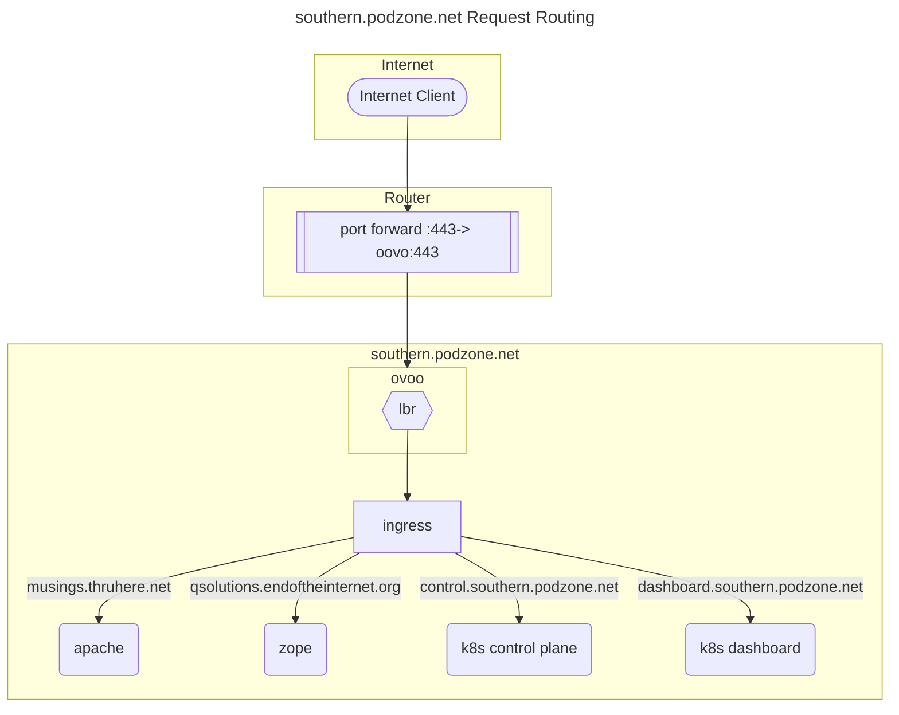

# Ingress

## Northern Zone: Flux configuration

- See <technicalProxy.md> for networking architecture of the second site.

### Addition of non-http ingresses

Non http-ingress is required for various use-cases. The first critical one is for off-site incoming streams for the radio. See technicalRadio.mds

## Ingress for Master and DJ

```yaml
apiVersion: v1
kind: ConfigMap
metadata:
  name: tcp-services
  namespace: ingress-nginx
data:
  8001: "radio/liquidsoap:8001"
  8002: "radio/liquidsoap:8002"
```

### Example

```text
The next example shows how to expose the service example-go running in the namespace default in the port 8080 using the port 9000
```

```yaml
apiVersion: v1
kind: ConfigMap
metadata:
  name: tcp-services
  namespace: ingress-nginx
data:
  9000: "default/example-go:8080"
```

```Then, the config map should be added to the ingress controller’s deployment args.

args:
    - /nginx-ingress-controller
    - --tcp-services-configmap=ingress-nginx/tcp-services
```

--set tcp-services-configmap=ingress-nginx/tcp-services

helm upgrade --set deployment.args="--inspect server.js" ...

helm upgrade --install ingress-nginx ingress-nginx --repo https://kubernetes.github.io/ingress-nginx --namespace ingress-nginx --set tcp-services-configmap=ingress-nginx/tcp-services

helm upgrade --reuse-values ingress-nginx ingress-nginx --repo https://kubernetes.github.io/ingress-nginx --set tcp-services-configmap=ingress-nginx/tcp-services  --namespace ingress-nginx


## References

- <https://kubernetes.github.io/ingress-nginx/user-guide/exposing-tcp-udp-services/>
- <https://docs.nginx.com/nginx-ingress-controller/configuration/global-configuration/command-line-arguments/>


## Southern Zone: manual configuration



## Ingress configuration

### L2 Load Balancer

MetalLB is used to implement an L2 load balancer. The metallb microk8s add-on is required:

- `sudo microk8s enable metallb`
- Production: Assign range: 192.168.0.131-192.168.0.132
- Dev: Assign range: 192.168.0.141-192.168.0.142

### Ingress Controller

An ingress controller is required. De-facto standard seems to be ingress-nginx.

Load ingress-nginx using helm:
  
- `sudo microk8s helm upgrade --install ingress-nginx ingress-nginx --repo https://kubernetes.github.io/ingress-nginx --namespace ingress-nginx --create-namespace`
- `sudo microk8s kubectl --namespace ingress-nginx get services -o wide -w ingress-nginx-controller`

NOTE: Enabling the microk8s add-on failed to produce a working ingress for me, not sure what I was doing wrong.

### Certificate Management

Enable the microk8s cert-manager, and define ClusterIssuer and Certificate requirements

- `sudo microk8s enable cert-manager`
- ClusterIssuer.yaml
- Certificates.yaml

### Ingress definition

Annotations link in the Certificate ClusterIssuer, and config to specify the hostname and tls secret. There is also an annotation to set the app-root.

- ApacheSecureIngress.yaml
