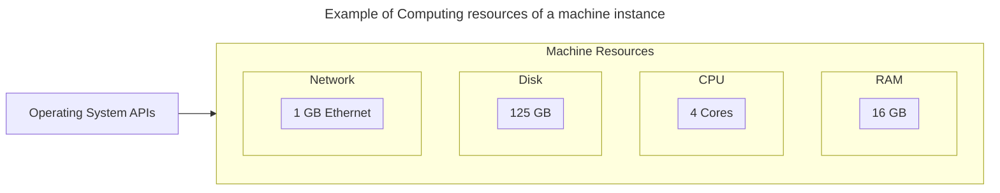
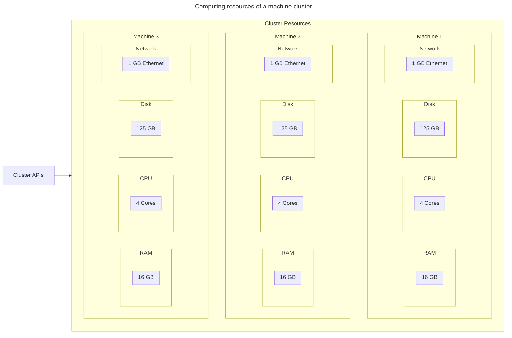
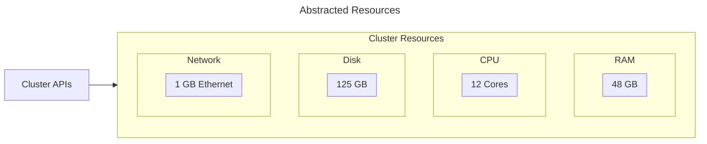

# Kubernetes

## Introduction

Kubernetes is an Open Source system that provides functionality to manage the lifecycle of containerised computing loads. It can achieve this over a clustered infrastructure, providing high availability, and scaling.

### Definitions

- `Kubernetes`: A *container* *orchestration* system.
- `Container`: Software packaging for a computing application, allowing it to be run in an *isolated environment* in a *standard* way.
- `Isolated environment`: Operating System features are used to separate an application from its environment and other computing workloads. Workload isolation provides security and resource governance.
- `Orchestration`: Automating software deployment, scaling, and management.

### Technology Trajectory

Kubernetes was developed within Google, and was donated as a seed technology to the Cloud Native Computing Foundation (CNCF).

A range of interrelated systems and standards underpin and extend Kubernetes that promote compatibility, providing consistency and reliability.

The CNCF has a large eco-system of technologies that complement and rely on kubernetes.

## Concepts

### Promise theory

- The design of kubernetes relies on the **Promise Theory** analysis methodology.
- Promise Theory in kubernetes allows a resource to be modelled as voluntarily and autonomously co-operating with other resources in the kubernetes system
- The use of declarative specification follows in the form of the publishing of a **Promise** to the kubernetes system in the form of a resource definition
- Resource definitions are loaded via the kubernetes API
- The kubernetes API is used to interact with the kubernetes system, and the objects deployed in the system.

### Clustering

Clustering provides a layer of abstraction for computing resources, spanning virtual or physical machines.

In a single machine instance the processes and applications interact with the machine's operating system apis.

In a cluster the processes and applications interact with the cluster system's apis.

### Clustered Resources

## References

- <https://en.wikipedia.org/wiki/Cloud_Native_Computing_Foundation>

- <https://en.wikipedia.org/wiki/Promise_theory>
