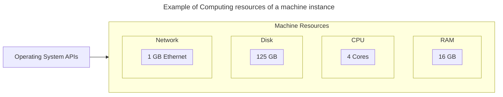
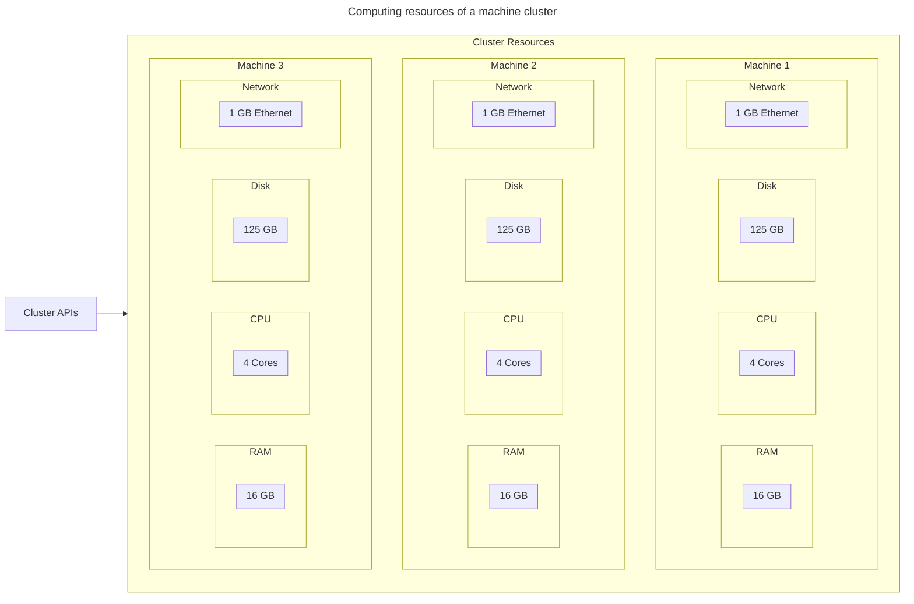
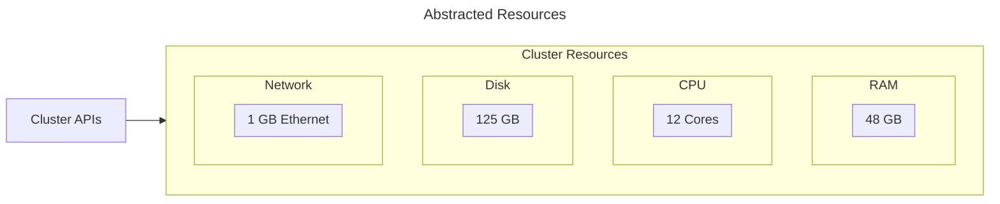

# Kubernetes

Kubernetes is a technology that provides a set of functionality to manage the lifecycle of computing loads. It provides features that provide for high availability, using clustering technologies.

## Clustering

Clustering provides a layer of abstraction for computing resources, spanning virtual or physical machines.

## Abstraction of Resources

### Virtual or Physical machine

### Clustered Resources

