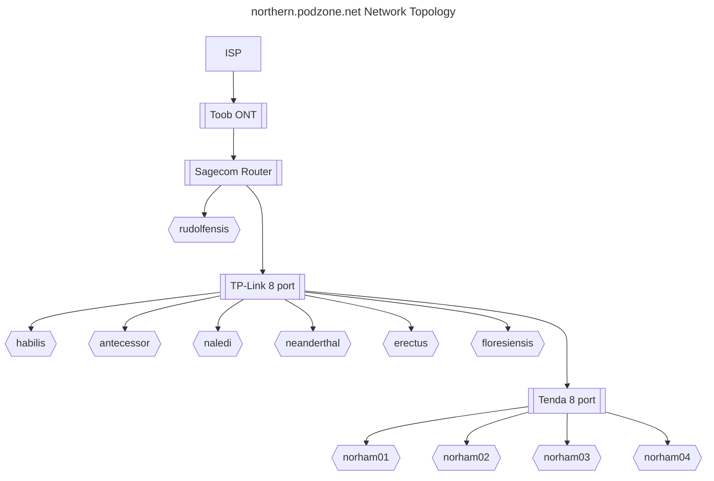
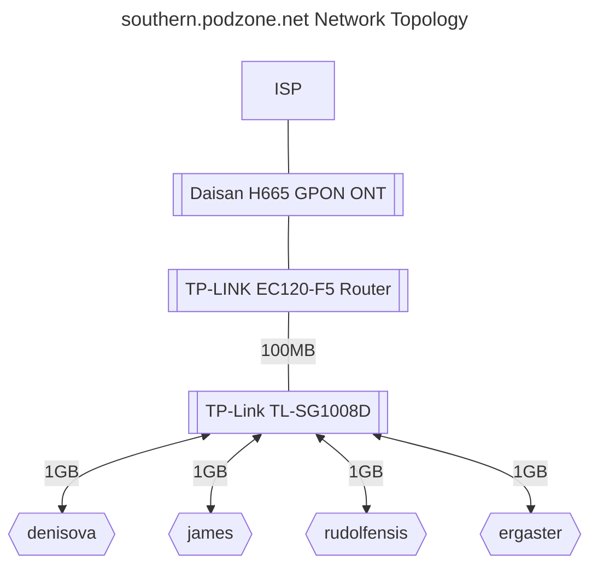

# Network Topology

This page describes the networking portion of the end to end solution. Physical network components and interconnectivity,
and https request routing for the northern and southern zones are described. At the time of refactoring of this document,
the southern zone is shut down, and will remain so for at least two months. Northern zone is up and running and taking production
traffic, but is failing some tests indicating a router upgrade. Therefore more detail will captured for the Northern zone,
and when the southern zone is re-constructed, will be supplemented.
Physical network topologies do not include client devices not included in solution scope.

## Northern

### Physical network components and interconnectivity

- Static IP required, because of cgnat: This was issued efficiently over the phone, at the additional cost of £8 pm.
- The Sagecom router issued by the ISP has configuration management and stability issues
- The ISP is now issuing Linksys `wi-fi 6` routers, so upgrade should be investigated

### Sagecom router

- port forwarding or dmz config changes require a gateway restart - network downtime
- port forwarding config breaks (port scan shows no open ports) every few days
- no logs appear in the router log available via the router gui

### Linksys `wi-fi 6` router

- 3 gigabit ethernet ports
- wifi 6
- Previous experience with Linksys routers suggests improved config management and stability. Review comments support this.

### Physical Network Topology

## Southern
 
- Southern zone hardware 

## References:

- <https://www.toob.co.uk/blog/ipv4-ipv6-and-cgnat-explained/>
- <https://forums.thinkbroadband.com/otherisp/4675486-toob-fttp-in-southampton.html>
- <https://diygardening.co.uk/off-topic/toob-review/#:~:text=Static%20ip%20Address%20Cost&text=%C2%A325%20per%20month%20for,you%20may%20wish%20to%20read.>
- <https://www.reddit.com/r/Southampton/comments/110it34/port_forwarding_on_toob/>
- <https://www.toob.co.uk/linksys-router/>
- <https://en.wikipedia.org/wiki/Wi-Fi_6>
- <https://www.ispreview.co.uk/talk/threads/new-linksys-router-on-toob.40622/>