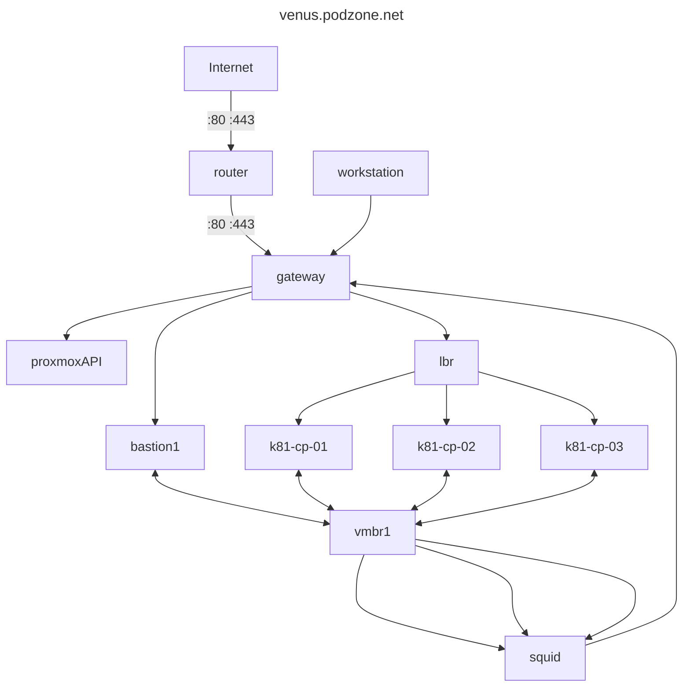

# Proxmox Hypervisor

## Network Architecture



- IP Tables Load Balancer: <https://github.com/muzahid-c/iptables-loadbalancer>

## Cloud init

- <https://austinsnerdythings.com/2021/08/30/how-to-create-a-proxmox-ubuntu-cloud-init-image/>

## Terraform

- Chosen approach: <https://github.com/rgl/terraform-proxmox-talos/tree/main>
- Docs: <https://developer.hashicorp.com/terraform/tutorials>
- Using terraform with proxmox: <https://austinsnerdythings.com/2021/09/01/how-to-deploy-vms-in-proxmox-with-terraform/>
- Using terraform with proxmox: <https://tcude.net/using-terraform-with-proxmox/>
- Proxmox Provider: <https://registry.terraform.io/providers/bpg/proxmox/latest/docs/guides/clone-vm>
- Proxmox Provider: <https://registry.terraform.io/providers/Telmate/proxmox/latest/docs>
- Tallos Provider: <https://github.com/siderolabs/terraform-provider-talos/blob/main/docs/index.md>

BGP provider:

```yaml
provider "proxmox" {
  endpoint = "https://10.0.0.2:8006/"

  # TODO: use terraform variable or remove the line, and use PROXMOX_VE_USERNAME environment variable
  username = "root@pam"
  # TODO: use terraform variable or remove the line, and use PROXMOX_VE_PASSWORD environment variable
  password = "the-password-set-during-installation-of-proxmox-ve"

  # because self-signed TLS certificate is in use
  insecure = true
  # uncomment (unless on Windows...)
  # tmp_dir  = "/var/tmp"

  ssh {
    agent = true
    # TODO: uncomment and configure if using api_token instead of password
    # username = "root"
  }
}
```

- VM Template:

```yaml
resource "proxmox_virtual_environment_vm" "ubuntu_template" {
  name      = "ubuntu-template"
  node_name = "pve"
  template = true
  started  = false
  machine     = "q35"
  bios        = "ovmf"
  description = "Managed by Terraform"
  cpu {
    cores = 2
  }
  memory {
    dedicated = 2048
  }
  efi_disk {
    datastore_id = "local"
    type         = "4m"
  }
  disk {
    datastore_id = "local-lvm"
    file_id      = proxmox_virtual_environment_download_file.ubuntu_cloud_image.id
    interface    = "virtio0"
    iothread     = true
    discard      = "on"
    size         = 20
  }
  initialization {
    ip_config {
      ipv4 {
        address = "dhcp"
      }
    }
    user_data_file_id = proxmox_virtual_environment_file.user_data_cloud_config.id
  }
  network_device {
    bridge = "vmbr0"
  }
}

resource "proxmox_virtual_environment_download_file" "ubuntu_cloud_image" {
  content_type = "iso"
  datastore_id = "local"
  node_name    = "pve"
  url = "https://cloud-images.ubuntu.com/jammy/current/jammy-server-cloudimg-amd64.img"
}
```

Clone MV from template:

```yaml
resource "proxmox_virtual_environment_vm" "ubuntu_clone" {
  name      = "ubuntu-clone"
  node_name = "pve"
  clone {
    vm_id = proxmox_virtual_environment_vm.ubuntu_template.id
  }
  agent {
    enabled = true
  }
  memory {
    dedicated = 768
  }
  initialization {
    dns {
      servers = ["1.1.1.1"]
    }
    ip_config {
      ipv4 {
        address = "dhcp"
      }
    }
  }
}
output "vm_ipv4_address" {
  value = proxmox_virtual_environment_vm.ubuntu_clone.ipv4_addresses[1][0]
}
```

### Tallos

- Terraform provider: <https://registry.terraform.io/providers/siderolabs/talos/latest/docs>
- Tallos Boostrap: <https://github.com/siderolabs/terraform-provider-talos/blob/main/docs/resources/machine_bootstrap.md>

### Authentication / Authorisation

Configure a user on proxmox:

```bash
pveum role add terraform-role -privs "VM.Allocate VM.Clone VM.Config.CDROM VM.Config.CPU VM.Config.Cloudinit VM.Config.Disk VM.Config.HWType VM.Config.Memory VM.Config.Network VM.Config.Options VM.Monitor VM.Audit VM.PowerMgmt Datastore.AllocateSpace Datastore.Audit"
pveum user add terraform@pve
pveum aclmod / -user terraform@pve -role terraform-role
pveum user token add terraform@pve terraform-token --privsep=0
```

Response:

```txt
┌──────────────┬──────────────────────────────────────┐
│ key          │ value                                │
╞══════════════╪══════════════════════════════════════╡
│ full-tokenid │ terraform@pve!provider               │
├──────────────┼──────────────────────────────────────┤
│ info         │ {"privsep":"0"}                      │
├──────────────┼──────────────────────────────────────┤
│ value        │ xxxxxxxxxxxxxxxxxxxxxxxxxxxxxxxxxxxx │
└──────────────┴──────────────────────────────────────┘
```

To use the token, export credentials for use by the provider:

```sh
export PM_USER="terraform-prov@pve"
export PM_PASS="password"
```

## Provisioning

- <https://github.com/christensenjairus/ClusterCreator>
- <https://cyber-engine.com/blog/2024/06/25/k8s-on-proxmox-using-clustercreator/>
- <https://github.com/DushanthaS/kubernetes-the-hard-way-on-proxmox>
- <https://github.com/siderolabs/image-factory>

## Monitoring

- <https://github.com/prometheus-community/helm-charts/tree/main/charts/kube-prometheus-stack>
- <https://github.com/prometheus-operator/kube-prometheus>
- Network Monitoring: <https://docs.cilium.io/en/stable/overview/intro/>
- Kubernetes Document Generation: <https://github.com/philippemerle/KubeDiagrams>
- Document Generation: <https://www.graphviz.org/>

### Monitoring hardware

- IPMI Tool suite: <https://www.gnu.org/software/freeipmi/>
- Dell idrac exporter: <https://github.com/galexrt/dellhw_exporter>
- Dell Redfish idrac exporter: <https://github.com/mrlhansen/idrac_exporter>
- Redfish idrac exporter: <https://github.com/jenningsloy318/redfish_exporter>
- Prometheus ipmi exporter: <https://github.com/prometheus-community/ipmi_exporter>
- SNMP Exporter: <https://github.com/prometheus/snmp_exporter>
- Helm chart for SNMP Exporter: <https://github.com/prometheus-community/helm-charts/tree/main/charts/prometheus-snmp-exporter>
- Node-Exporter ipmitool collector: <https://github.com/prometheus-community/node-exporter-textfile-collector-scripts/blob/master/ipmitool>
- Grafana Dashboard for idrac: <https://grafana.com/grafana/dashboards/13177-ipmi-for-prometheus/>

## Cloudinit

- Creating template files: <https://github.com/trfore/proxmox-template-scripts?tab=readme-ov-file>

## Storage

- <https://github.com/LINBIT/linstor-server>
- <https://linbit.com/drbd/>
- <https://github.com/piraeusdatastore/piraeus-operator>
- <https://syncthing.net/>
- <https://github.com/sergelogvinov/proxmox-csi-plugin>

## References

- <https://blog.stonegarden.dev/articles/2024/08/talos-proxmox-tofu/>
- <https://github.com/rgl/terraform-proxmox-talos>
- <https://olav.ninja/talos-cluster-on-proxmox-with-terraform>
- <https://github.com/kubernetes-sigs/kubespray>
- <https://kubespray.io/>
- <https://blog.andreasm.io/2024/01/15/proxmox-with-opentofu-kubespray-and-kubernetes/>
- <https://medium.com/@abhigyan.dwivedi_58961/creating-a-kvm-kubernetes-cluster-with-vagrant-kubespray-and-ansible-a-idiot-resistant-guide-2f3727ce7039>