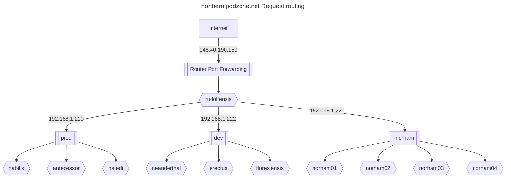

# Reverse proxy

The northern site needed to be issued with a static IP address from the ISP.

With one cluster on site, this IP address would have port forwarding configured on the router, to send http and https traffic to the metallb L2 load balancer.

However, since more than on cluster will be served on the same IP address, a front-end proxy is installed on a t520, which will also run ddclient.

## Certbot

In order to reverse proxy to the https endpoints in the cluster, we need to terminate ssl for all hosts supported. LetsEncryp's Certbot is used, with the following hosts:

```text
blog.podzone.org,central.podzone.net,control.podzone.net,dev.podzone.net,prod.podzone.net,docs.podzone.net,gymyc.podzone.net,musings.thruhere.net,north.podzone.net,northern.podzone.net,wordpress.podzone.org,adam.blog.podzone.org,charles.blog.podzone.org,motttt.blog.podzone.org,dbgui.dev.podzone.net
```

## Northern request routing



### Sample config file

### Rudolfensis Apache configuration file

ServerName north.podzone.net

```conf
<VirtualHost *:443>
  SSLProxyEngine on
  SSLProxyVerify none
  ProxyPreserveHost on
  ProxyPass /  https://192.168.1.220/
  ProxyPassReverse /  https://192.168.1.220/
  ProxyRequests Off
ServerAlias blog.podzone.org
Include /etc/letsencrypt/options-ssl-apache.conf
ServerAlias central.podzone.net
ServerAlias control.podzone.net
ServerAlias dev.podzone.net
ServerAlias prod.podzone.net
ServerAlias docs.podzone.net
ServerAlias gymyc.podzone.net
ServerAlias musings.thruhere.net
ServerAlias north.podzone.net
ServerAlias northern.podzone.net
ServerAlias wordpress.podzone.org
ServerAlias adam.blog.podzone.org
ServerAlias charles.blog.podzone.org
ServerAlias motttt.blog.podzone.org
ServerAlias dbgui.dev.podzone.net
ServerAlias norma.blog.podzone.org
ServerAlias uktoday.blogsite.org
ServerAlias uktoday.thruhere.net
ServerAlias uktoday.podzone.org
ServerAlias uktoday.podzone.net
ServerAlias uktoday.blog.podzone.org
ServerAlias ceph.northern.podzone.net
SSLCertificateFile /etc/letsencrypt/live/blog.podzone.org/fullchain.pem
SSLCertificateKeyFile /etc/letsencrypt/live/blog.podzone.org/privkey.pem
</VirtualHost>
<VirtualHost *:80>
  ProxyPreserveHost on
  ProxyPass /  http://192.168.1.220/
  ProxyPassReverse /  http://192.168.1.220/
  ProxyRequests Off
ServerAlias blog.podzone.org
ServerAlias central.podzone.net
ServerAlias control.podzone.net
ServerAlias dev.podzone.net
ServerAlias prod.podzone.net
ServerAlias docs.podzone.net
ServerAlias gymyc.podzone.net
ServerAlias musings.thruhere.net
ServerAlias north.podzone.net
ServerAlias northern.podzone.net
ServerAlias wordpress.podzone.org
ServerAlias adam.blog.podzone.org
ServerAlias charles.blog.podzone.org
ServerAlias motttt.blog.podzone.org
ServerAlias dbgui.dev.podzone.net
ServerAlias norma.blog.podzone.org
ServerAlias uktoday.blogsite.org
ServerAlias uktoday.thruhere.net
ServerAlias uktoday.podzone.org
ServerAlias uktoday.podzone.net
ServerAlias uktoday.blog.podzone.org

#RewriteEngine on
#RewriteCond %{SERVER_NAME} =musings.thruhere.net [OR]
#RewriteCond %{SERVER_NAME} =blog.podzone.org [OR]
#RewriteCond %{SERVER_NAME} =gymyc.podzone.net [OR]
#RewriteCond %{SERVER_NAME} =northern.podzone.net [OR]
#RewriteCond %{SERVER_NAME} =dev.podzone.net [OR]
#RewriteCond %{SERVER_NAME} =prod.podzone.net [OR]
#RewriteCond %{SERVER_NAME} =central.podzone.net [OR]
#RewriteCond %{SERVER_NAME} =docs.podzone.net [OR]
#RewriteCond %{SERVER_NAME} =wordpress.podzone.org [OR]
#RewriteCond %{SERVER_NAME} =motttt.blog.podzone.org [OR]
#RewriteCond %{SERVER_NAME} =north.podzone.net [OR]
#RewriteCond %{SERVER_NAME} =adam.blog.podzone.org [OR]
#RewriteCond %{SERVER_NAME} =control.podzone.net [OR]
#RewriteCond %{SERVER_NAME} =charles.blog.podzone.org [OR]
#RewriteCond %{SERVER_NAME} =dbgui.dev.podzone.net
#RewriteRule ^ https://%{SERVER_NAME}%{REQUEST_URI} [END,NE,R=permanent]
RewriteEngine on
RewriteCond %{SERVER_NAME} =central.podzone.net [OR]
RewriteCond %{SERVER_NAME} =control.podzone.net [OR]
RewriteCond %{SERVER_NAME} =uktoday.podzone.org [OR]
RewriteCond %{SERVER_NAME} =uktoday.podzone.net [OR]
RewriteCond %{SERVER_NAME} =wordpress.podzone.org [OR]
RewriteCond %{SERVER_NAME} =gymyc.podzone.net [OR]
RewriteCond %{SERVER_NAME} =uktoday.blog.podzone.org [OR]
RewriteCond %{SERVER_NAME} =dev.podzone.net [OR]
RewriteCond %{SERVER_NAME} =charles.blog.podzone.org [OR]
RewriteCond %{SERVER_NAME} =prod.podzone.net [OR]
RewriteCond %{SERVER_NAME} =northern.podzone.net [OR]
RewriteCond %{SERVER_NAME} =blog.podzone.org [OR]
RewriteCond %{SERVER_NAME} =uktoday.blogsite.org [OR]
RewriteCond %{SERVER_NAME} =adam.blog.podzone.org [OR]
RewriteCond %{SERVER_NAME} =norma.blog.podzone.org [OR]
RewriteCond %{SERVER_NAME} =north.podzone.net [OR]
RewriteCond %{SERVER_NAME} =dbgui.dev.podzone.net [OR]
RewriteCond %{SERVER_NAME} =docs.podzone.net [OR]
RewriteCond %{SERVER_NAME} =motttt.blog.podzone.org [OR]
RewriteCond %{SERVER_NAME} =ceph.northern.podzone.net [OR]
RewriteCond %{SERVER_NAME} =uktoday.thruhere.net [OR]
RewriteCond %{SERVER_NAME} =musings.thruhere.net
RewriteRule ^ https://%{SERVER_NAME}%{REQUEST_URI} [END,NE,R=permanent]
</VirtualHost>
```

### Reconfigured Virtual Hosts

```conf
<VirtualHost *:443>
  ServerName north.podzone.net
  ServerAlias adam.blog.podzone.org
  ServerAlias charles.blog.podzone.org
  ServerAlias motttt.blog.podzone.org
  ServerAlias dbgui.dev.podzone.net
  ServerAlias norma.blog.podzone.org
  ServerAlias uktoday.blogsite.org
  ServerAlias uktoday.thruhere.net
  ServerAlias uktoday.podzone.org
  ServerAlias uktoday.podzone.net
  ServerAlias uktoday.blog.podzone.org
  ServerAlias central.podzone.net
  ServerAlias control.podzone.net
  ServerAlias dev.podzone.net
  ServerAlias prod.podzone.net
  ServerAlias docs.podzone.net
  ServerAlias blog.podzone.org
  ServerAlias musings.thruhere.net
  SSLProxyEngine on
  SSLProxyVerify none
  ProxyPreserveHost on
  ProxyPass /  https://192.168.1.220/
  ProxyPassReverse /  https://192.168.1.220/
  ProxyRequests Off
  Include /etc/letsencrypt/options-ssl-apache.conf
  SSLCertificateFile /etc/letsencrypt/live/blog.podzone.org/fullchain.pem
  SSLCertificateKeyFile /etc/letsencrypt/live/blog.podzone.org/privkey.pem
</VirtualHost>
<VirtualHost *:80>
  ServerName north.podzone.net
  ServerAlias adam.blog.podzone.org
  ServerAlias charles.blog.podzone.org
  ServerAlias motttt.blog.podzone.org
  ServerAlias dbgui.dev.podzone.net
  ServerAlias norma.blog.podzone.org
  ServerAlias uktoday.blogsite.org
  ServerAlias uktoday.thruhere.net
  ServerAlias uktoday.podzone.org
  ServerAlias uktoday.podzone.net
  ServerAlias uktoday.blog.podzone.org
  ServerAlias central.podzone.net
  ServerAlias control.podzone.net
  ServerAlias dev.podzone.net
  ServerAlias prod.podzone.net
  ServerAlias docs.podzone.net
  ServerAlias blog.podzone.org
  ServerAlias musings.thruhere.net
  ProxyPreserveHost on
  ProxyPass /  http://192.168.1.220/
  ProxyPassReverse /  http://192.168.1.220/
  ProxyRequests Off
</VirtualHost>
<VirtualHost *:443>
  ServerName northern.podzone.net
  ServerAlias ceph.northern.podzone.net
  SSLProxyEngine on
  SSLProxyVerify none
  <Proxy balancer://ceph>
    BalancerMember http://192.168.1.112:8080/
    BalancerMember http://192.168.1.113:8080/
    BalancerMember http://192.168.1.117:8080/
    ProxySet lbmethod=bytraffic
  </Proxy>
  ProxyPreserveHost on
  ProxyPass /  "balancer://ceph/"
  ProxyPassReverse /  "balancer://ceph/"
  ProxyRequests Off
  Include /etc/letsencrypt/options-ssl-apache.conf
  SSLCertificateFile /etc/letsencrypt/live/blog.podzone.org/fullchain.pem
  SSLCertificateKeyFile /etc/letsencrypt/live/blog.podzone.org/privkey.pem
</VirtualHost>
<VirtualHost *:80>
  ServerName northern.podzone.net
  ServerAlias ceph.northern.podzone.net
  RewriteEngine on
  RewriteCond %{SERVER_NAME} =northern.podzone.net [OR]
  RewriteCond %{SERVER_NAME} =ceph.northern.podzone.net
  RewriteRule ^ https://%{SERVER_NAME}%{REQUEST_URI} [END,NE,R=permanent]
</VirtualHost>

  ServerAlias gymyc.podzone.net
  ServerAlias north.podzone.net
  ServerAlias northern.podzone.net
  ServerAlias wordpress.podzone.org
  ServerAlias ceph.northern.podzone.net

  ProxyPreserveHost on
  ProxyPass /  http://192.168.1.113:8080/
  ProxyPassReverse /  http://192.168.1.113:8080/
  ProxyRequests Off
```

### radio reverse proxy

```httpd.conf
<VirtualHost *:443>
  ServerName radio.thruhere.net
  ProxyPreserveHost on
  ProxyPass /  https://192.168.1.222/
  ProxyPassReverse /  https://192.168.1.222/
  ProxyRequests Off
  SSLEngine on
  SSLProxyEngine on
  SSLProxyVerify none
  Include /etc/letsencrypt/options-ssl-apache.conf
  SSLCertificateFile /etc/letsencrypt/live/blog.podzone.org/fullchain.pem
  SSLCertificateKeyFile /etc/letsencrypt/live/blog.podzone.org/privkey.pem
</VirtualHost>

<VirtualHost *:80>
  ServerName radio.thruhere.net
  ProxyPreserveHost on
  ProxyPass /  http://192.168.1.222/
  ProxyPassReverse /  http://192.168.1.222/
  ProxyRequests Off
</VirtualHost>

<VirtualHost *:443>
  ServerName console.thruhere.net
  ProxyPreserveHost on
  ProxyPass /  https://192.168.1.222/
  ProxyPassReverse /  https://192.168.1.222/
  ProxyRequests Off
  SSLEngine on
  SSLProxyEngine on
  SSLProxyVerify none
  Include /etc/letsencrypt/options-ssl-apache.conf
  SSLCertificateFile /etc/letsencrypt/live/blog.podzone.org/fullchain.pem
  SSLCertificateKeyFile /etc/letsencrypt/live/blog.podzone.org/privkey.pem
</VirtualHost>

<VirtualHost *:80>
  ServerName console.thruhere.net
  ProxyPreserveHost on
  ProxyPass /  http://192.168.1.222/
  ProxyPassReverse /  http://192.168.1.222/
  ProxyRequests Off
</VirtualHost>
```


### Ceph dashboard issues

- Unsuccessful load balancer configuration, due to ceph redirect to active dashboard node

## Adding a domain

To add a domain, e.g. norma.blog.podzone.org, call certbot with the `--expand` option.

### Current list

```bash
certbot --expand -d blog.podzone.org,central.podzone.net,control.podzone.net,dev.podzone.net,prod.podzone.net,docs.podzone.net,gymyc.podzone.net,musings.thruhere.net,north.podzone.net,northern.podzone.net,wordpress.podzone.org,adam.blog.podzone.org,charles.blog.podzone.org,motttt.blog.podzone.org,dbgui.dev.podzone.net,norma.blog.podzone.org,uktoday.blogsite.org,uktoday.thruhere.net,uktoday.podzone.org,uktoday.podzone.net,uktoday.blog.podzone.org,ceph.northern.podzone.net,radio.thruhere.net,www.radio.thruhere.net,console.thruhere.net,dj.radio.thruhere.net,master.radio.thruhere.net,www.radio.thruhere.net,console.thruhere.net,dj.radio.thruhere.net,master.radio.thruhere.net,www.asazimusic.com,asazimusic.com,dialplus44.com,www.dialplus44.com,dialplus44.uk,www.dialplus44.uk,projecttoolkit.co.uk,project-tech.co.uk
```

## Additional domains

### UK Today

- uktoday.blogsite.org
- uktoday.thruhere.net
- uktoday.podzone.org
- uktoday.podzone.net
- uktoday.blog.podzone.org

## Unused DynDns hosts

- east.podzone.net
- eastern.podzone.net
- southern.podzone.net
- west.podzone.net
- western.podzone.net
- colley.endoftheinternet.org
- mottttspot.servegame.org
- poc.endoftheinternet.org
- qapps.does-it.net
- qsolutions.endoftheinternet.org

## References

- <https://github.com/mcallegari/qlcplus>
- <https://en.wikipedia.org/wiki/Server_Name_Indication>
- <https://serverfault.com/questions/1043940/apache-reverse-proxy-preserving-ssl>
- <https://www.reddit.com/r/sysadmin/comments/3vvz86/is_there_a_way_to_do_ssl_passthrough_via_an/>
- <https://eff-certbot.readthedocs.io/en/latest/using.html#re-creating-and-updating-existing-certificates>
