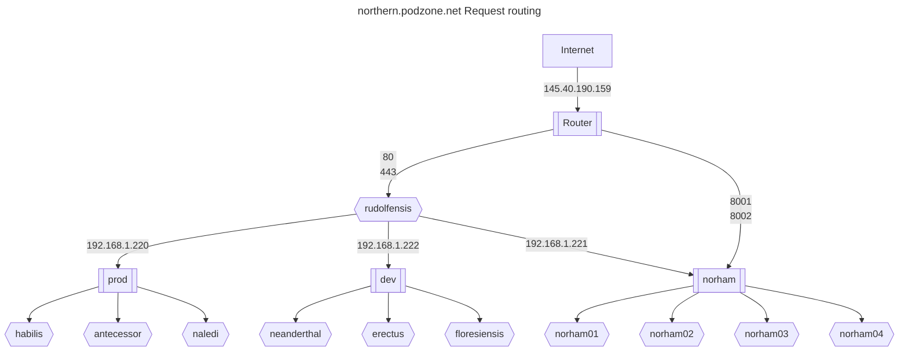

# Reverse proxy

The northern site needed to be issued with a static IP address from the ISP.

With one cluster on site, this IP address would have port forwarding configured on the router, to send http and https traffic to the metallb L2 load balancer.

However, since more than on cluster will be served on the same IP address, a front-end proxy is installed on a t520.

## Certbot

In order to reverse proxy to the https endpoints in the cluster, we need to terminate ssl for all hosts supported. LetsEncryp's Certbot is used.

## Northern request routing



### Sample config file

Note that the http to https redirect that Certbot adds needs to be disabled, otherwise certificate generation on the cluster will not work, as the listeners set up by Certificate Managers will not be reachable.

### Top of stack reverse proxy

```conf
<VirtualHost *:443>
  SSLProxyEngine on
  SSLProxyVerify none
  ProxyPreserveHost on
  ProxyPass /  https://192.168.1.220/
  ProxyPassReverse /  https://192.168.1.220/
  ProxyRequests Off
  Include /etc/letsencrypt/options-ssl-apache.conf
  SSLCertificateFile /etc/letsencrypt/live/blog.podzone.org/fullchain.pem
  SSLCertificateKeyFile /etc/letsencrypt/live/blog.podzone.org/privkey.pem
  ServerName ...
  ServerAlias ...
</VirtualHost>
<VirtualHost *:80>
  ProxyPreserveHost on
  ProxyPass /  http://192.168.1.220/
  ProxyPassReverse /  http://192.168.1.220/
  ProxyRequests Off
  ServerName ...
  ServerAlias ...
  #RewriteEngine on
  #RewriteCond %{SERVER_NAME} =...
  #RewriteRule ^ https://%{SERVER_NAME}%{REQUEST_URI} [END,NE,R=permanent]
</VirtualHost>
```

## Adding a domain

To add a domain, e.g. norma.blog.podzone.org, call certbot with the `--expand` option.

### Current list

Add entries and check in before applying.

```bash
certbot --expand -d docs.podzone.net,musings.thruhere.net,uk2day.online,www.uk2day.online,muso.club,db.muso.club,console.muso.club,broadcast.muso.club,radio.muso.club,www.muso.club,radio.thruhere.net,console.thruhere.net,norma.blog.podzone.org
```

### Domain evaluation 30 May 2024

#### Domains in certbot spec that are used currently or to be retained

##### Prod

- <docs.podzone.net>
- <musings.thruhere.net>
- <uk2day.online>
- <www.uk2day.online>

##### Muso Club

- <muso.club>
- <db.muso.club>
- <console.muso.club>
- <broadcast.muso.club>
- <radio.muso.club>
- <www.muso.club>

##### For non-prod radio

- <radio.thruhere.net>
- <console.thruhere.net>

##### Wordpress instances

- <www.dialplus44.com>
- <dialplus44.uk>
- <dialplus44.com>
- <www.dialplus44.uk>
- <www.asazimusic.com>
- <asazimusic.com>
- <norma.blog.podzone.org>
- <adam.blog.podzone.org>
- <motttt.blog.podzone.org>
- <projecttoolkit.co.uk>
- <project-tech.co.uk>

##### Fabric Ingress

- <central.podzone.net>
- <control.podzone.net>
- <north.podzone.net>

## Unused DynDns hosts

- <east.podzone.net>
- <eastern.podzone.net>
- <southern.podzone.net>
- <west.podzone.net>
- <western.podzone.net>
- <colley.endoftheinternet.org>
- <mottttspot.servegame.org>
- <poc.endoftheinternet.org>
- <qapps.does-it.net>
- <qsolutions.endoftheinternet.org>
- <www.radio.muso.club>
- <gymyc.podzone.net>
- <charles.blog.podzone.org>
- <wordpress.podzone.org>
- <blog.podzone.org>
- <uktoday.blogsite.org>
- <uktoday.thruhere.net>
- <uktoday.podzone.org>
- <uktoday.podzone.net>
- <uktoday.blog.podzone.org>
- <www.jam.radio.fm>
- <jam.radio.fm>
- <console.jam.radio.fm>
- <broadcast.jam.radio.fm>
- <dj.radio.thruhere.net>
- <master.radio.thruhere.net>
- <radio.thruhere.net>
- <www.radio.thruhere.net>
- <dev.podzone.net>
- <prod.podzone.net>
- <northern.podzone.net>
- <ceph.northern.podzone.net>
- <dbgui.dev.podzone.net>

## References

- <https://github.com/mcallegari/qlcplus>
- <https://en.wikipedia.org/wiki/Server_Name_Indication>
- <https://serverfault.com/questions/1043940/apache-reverse-proxy-preserving-ssl>
- <https://www.reddit.com/r/sysadmin/comments/3vvz86/is_there_a_way_to_do_ssl_passthrough_via_an/>
- <https://eff-certbot.readthedocs.io/en/latest/using.html#re-creating-and-updating-existing-certificates>
