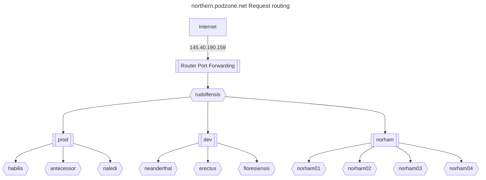

# Reverse proxy

The northern site needed to be issued with a static IP address from the ISP.

With one cluster on site, this IP address would have port forwarding configured on the router, to send http and https traffic to the metallb L2 load balancer.

However, since more than on cluster will be served on the same IP address, a front-end proxy is installed on a t520, which will also run ddclient.

## Certbot

In order to reverse proxy to the https endpoints in the cluster, we need to terminate ssl for all hosts supported. LetsEncryp's Certbot is used, with the following hosts:

```text
blog.podzone.org,central.podzone.net,control.podzone.net,dev.podzone.net,prod.podzone.net,docs.podzone.net,gymyc.podzone.net,musings.thruhere.net,north.podzone.net,northern.podzone.net,wordpress.podzone.org,adam.blog.podzone.org,charles.blog.podzone.org,motttt.blog.podzone.org,dbgui.dev.podzone.net
```

## Northern request routing




### Sample config file

<VirtualHost *:443>
  SSLProxyEngine on
  SSLProxyVerify none
  ProxyPreserveHost on
  ProxyPass /  https://192.168.1.220/
  ProxyPassReverse /  https://192.168.1.220/
  ProxyRequests Off
  ServerName blog.podzone.org
  Include /etc/letsencrypt/options-ssl-apache.conf
  ServerAlias central.podzone.net
  ServerAlias control.podzone.net
  ServerAlias dev.podzone.net
  ServerAlias prod.podzone.net
  ServerAlias docs.podzone.net
  ServerAlias gymyc.podzone.net
  ServerAlias musings.thruhere.net
  ServerAlias north.podzone.net
  ServerAlias northern.podzone.net
  ServerAlias wordpress.podzone.org
  ServerAlias adam.blog.podzone.org
  ServerAlias charles.blog.podzone.org
  ServerAlias motttt.blog.podzone.org
  ServerAlias dbgui.dev.podzone.net
  SSLCertificateFile /etc/letsencrypt/live/blog.podzone.org/fullchain.pem
  SSLCertificateKeyFile /etc/letsencrypt/live/blog.podzone.org/privkey.pem
</VirtualHost>
<VirtualHost *:80>
  ProxyPreserveHost on
  ProxyPass /  http://192.168.1.220/
  ProxyPassReverse /  http://192.168.1.220/
  ProxyRequests Off
  RewriteEngine on
  RewriteCond %{SERVER_NAME} =musings.thruhere.net [OR]
  RewriteCond %{SERVER_NAME} =blog.podzone.org [OR]
  RewriteCond %{SERVER_NAME} =gymyc.podzone.net [OR]
  RewriteCond %{SERVER_NAME} =northern.podzone.net [OR]
  RewriteCond %{SERVER_NAME} =dev.podzone.net [OR]
  RewriteCond %{SERVER_NAME} =prod.podzone.net [OR]
  RewriteCond %{SERVER_NAME} =central.podzone.net [OR]
  RewriteCond %{SERVER_NAME} =docs.podzone.net [OR]
  RewriteCond %{SERVER_NAME} =wordpress.podzone.org [OR]
  RewriteCond %{SERVER_NAME} =motttt.blog.podzone.org [OR]
  RewriteCond %{SERVER_NAME} =north.podzone.net [OR]
  RewriteCond %{SERVER_NAME} =adam.blog.podzone.org [OR]
  RewriteCond %{SERVER_NAME} =control.podzone.net [OR]
  RewriteCond %{SERVER_NAME} =charles.blog.podzone.org [OR]
  RewriteCond %{SERVER_NAME} =dbgui.dev.podzone.net
  RewriteRule ^ https://%{SERVER_NAME}%{REQUEST_URI} [END,NE,R=permanent]
</VirtualHost>

## Adding a domain

To add a domain, e.g. norma.blog.podzone.org, call certbot with the `--expand` option.

### Current list

```bash
certbot --expand -d blog.podzone.org,central.podzone.net,control.podzone.net,dev.podzone.net,prod.podzone.net,docs.podzone.net,gymyc.podzone.net,musings.thruhere.net,north.podzone.net,northern.podzone.net,wordpress.podzone.org,adam.blog.podzone.org,charles.blog.podzone.org,motttt.blog.podzone.org,dbgui.dev.podzone.net,norma.blog.podzone.org,uktoday.blogsite.org,uktoday.thruhere.net,uktoday.podzone.org,uktoday.podzone.net,uktoday.blog.podzone.org
```

## Additional domains

### UK Today

- uktoday.blogsite.org
- uktoday.thruhere.net
- uktoday.podzone.org
- uktoday.podzone.net
- uktoday.blog.podzone.org

## Unused DynDns hosts

- east.podzone.net
- eastern.podzone.net
- southern.podzone.net
- west.podzone.net
- western.podzone.net
- colley.endoftheinternet.org
- mottttspot.servegame.org
- poc.endoftheinternet.org
- qapps.does-it.net
- qsolutions.endoftheinternet.org

## References

- <https://github.com/mcallegari/qlcplus>
- <https://en.wikipedia.org/wiki/Server_Name_Indication>
- <https://serverfault.com/questions/1043940/apache-reverse-proxy-preserving-ssl>
- <https://www.reddit.com/r/sysadmin/comments/3vvz86/is_there_a_way_to_do_ssl_passthrough_via_an/>
- <https://eff-certbot.readthedocs.io/en/latest/using.html#re-creating-and-updating-existing-certificates>