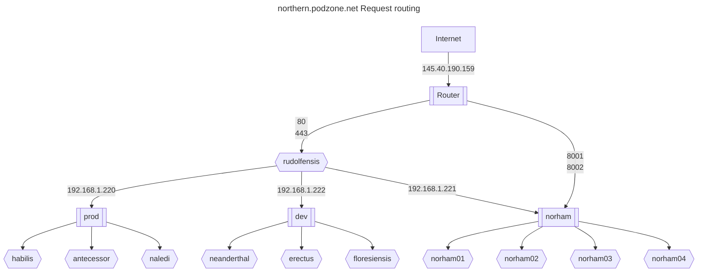

# Reverse proxy

The northern site needed to be issued with a static IP address from the ISP.

With one cluster on site, this IP address would have port forwarding configured on the router, to send http and https traffic to the metallb L2 load balancer.

However, since more than on cluster will be served on the same IP address, a front-end proxy is installed on a t520, which will also run ddclient.

## Certbot

In order to reverse proxy to the https endpoints in the cluster, we need to terminate ssl for all hosts supported. LetsEncryp's Certbot is used.

## Northern request routing



### Sample config file

Note that the http to https redirect that Certbot adds needs to be disabled, otherwise certificate generation on the cluster will not work, as the listeners set up by Certificate Managers will not be reachable.

### Top of stack reverse proxy


```conf
<VirtualHost *:443>
  SSLProxyEngine on
  SSLProxyVerify none
  ProxyPreserveHost on
  ProxyPass /  https://192.168.1.220/
  ProxyPassReverse /  https://192.168.1.220/
  ProxyRequests Off
  Include /etc/letsencrypt/options-ssl-apache.conf
  SSLCertificateFile /etc/letsencrypt/live/blog.podzone.org/fullchain.pem
  SSLCertificateKeyFile /etc/letsencrypt/live/blog.podzone.org/privkey.pem
  ServerName ...
  ServerAlias ...
</VirtualHost>
<VirtualHost *:80>
  ProxyPreserveHost on
  ProxyPass /  http://192.168.1.220/
  ProxyPassReverse /  http://192.168.1.220/
  ProxyRequests Off
  ServerName ...
  ServerAlias ...
  #RewriteEngine on
  #RewriteCond %{SERVER_NAME} =...
  #RewriteRule ^ https://%{SERVER_NAME}%{REQUEST_URI} [END,NE,R=permanent]
</VirtualHost>
```

### Ceph dashboard issues

- Unsuccessful load balancer configuration, due to ceph redirect to active dashboard node

```xml
  <Proxy balancer://ceph>
    BalancerMember http://192.168.1.112:8080/
    BalancerMember http://192.168.1.113:8080/
    BalancerMember http://192.168.1.117:8080/
    ProxySet lbmethod=bytraffic
  </Proxy>
  ProxyPreserveHost on
  ProxyPass /  "balancer://ceph/"
  ProxyPassReverse /  "balancer://ceph/"
```

## Adding a domain

To add a domain, e.g. norma.blog.podzone.org, call certbot with the `--expand` option.

### Current list

Add entries and check in before applying.

```bash
certbot --expand -d blog.podzone.org,central.podzone.net,control.podzone.net,dev.podzone.net,prod.podzone.net,docs.podzone.net,gymyc.podzone.net,musings.thruhere.net,north.podzone.net,northern.podzone.net,wordpress.podzone.org,adam.blog.podzone.org,charles.blog.podzone.org,motttt.blog.podzone.org,dbgui.dev.podzone.net,norma.blog.podzone.org,uktoday.blogsite.org,uktoday.thruhere.net,uktoday.podzone.org,uktoday.podzone.net,uktoday.blog.podzone.org,ceph.northern.podzone.net,radio.thruhere.net,www.radio.thruhere.net,console.thruhere.net,dj.radio.thruhere.net,master.radio.thruhere.net,www.radio.thruhere.net,console.thruhere.net,dj.radio.thruhere.net,master.radio.thruhere.net,www.asazimusic.com,asazimusic.com,dialplus44.com,www.dialplus44.com,dialplus44.uk,www.dialplus44.uk,projecttoolkit.co.uk,project-tech.co.uk,www.jam.radio.fm,jam.radio.fm,console.jam.radio.fm,broadcast.jam.radio.fm,uk2day.online,www.uk2day.online
```

## Additional domains

### UK Today

- uktoday.blogsite.org
- uktoday.thruhere.net
- uktoday.podzone.org
- uktoday.podzone.net
- uktoday.blog.podzone.org

## Unused DynDns hosts

- east.podzone.net
- eastern.podzone.net
- southern.podzone.net
- west.podzone.net
- western.podzone.net
- colley.endoftheinternet.org
- mottttspot.servegame.org
- poc.endoftheinternet.org
- qapps.does-it.net
- qsolutions.endoftheinternet.org

## References

- <https://github.com/mcallegari/qlcplus>
- <https://en.wikipedia.org/wiki/Server_Name_Indication>
- <https://serverfault.com/questions/1043940/apache-reverse-proxy-preserving-ssl>
- <https://www.reddit.com/r/sysadmin/comments/3vvz86/is_there_a_way_to_do_ssl_passthrough_via_an/>
- <https://eff-certbot.readthedocs.io/en/latest/using.html#re-creating-and-updating-existing-certificates>
