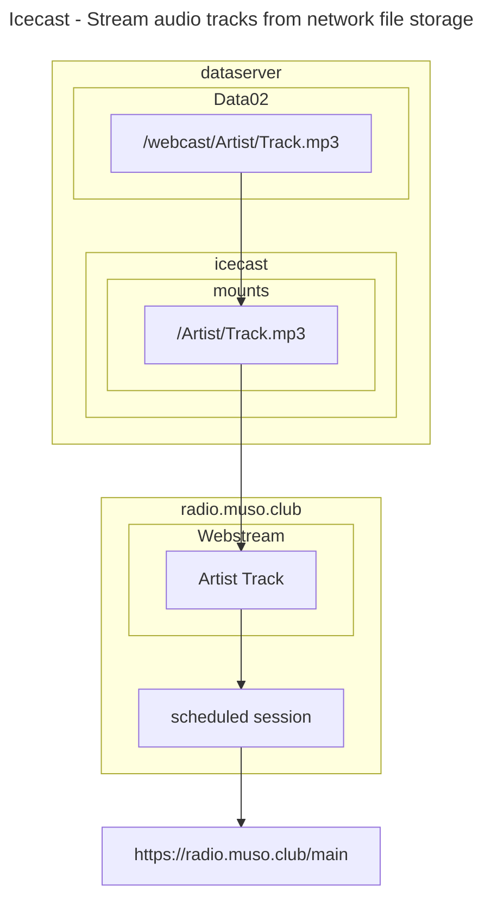
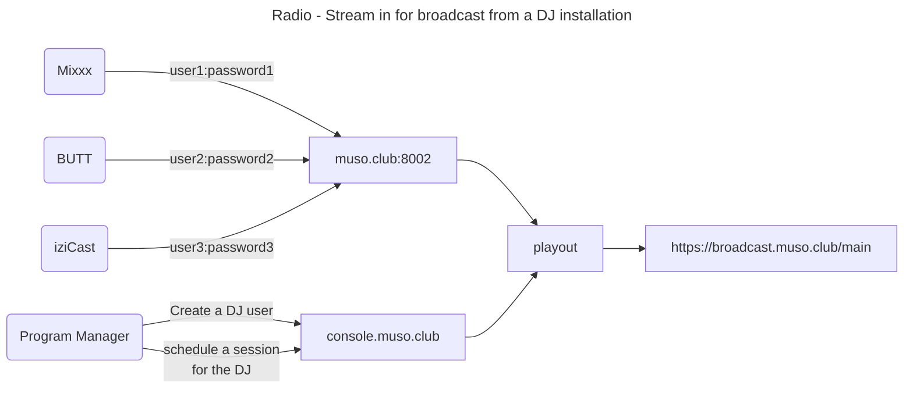
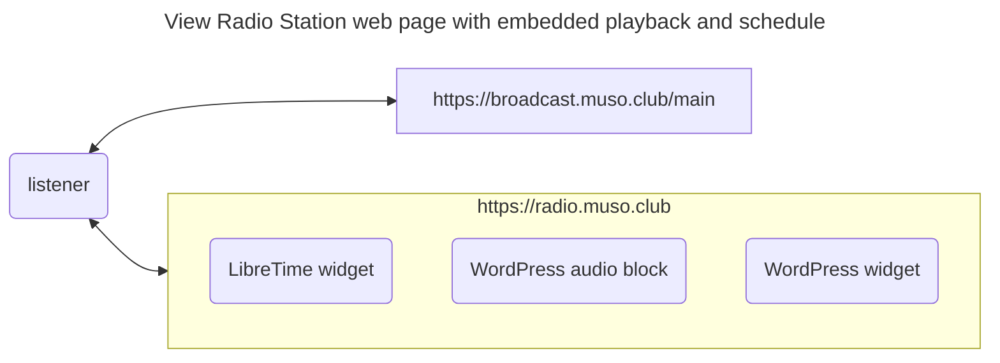
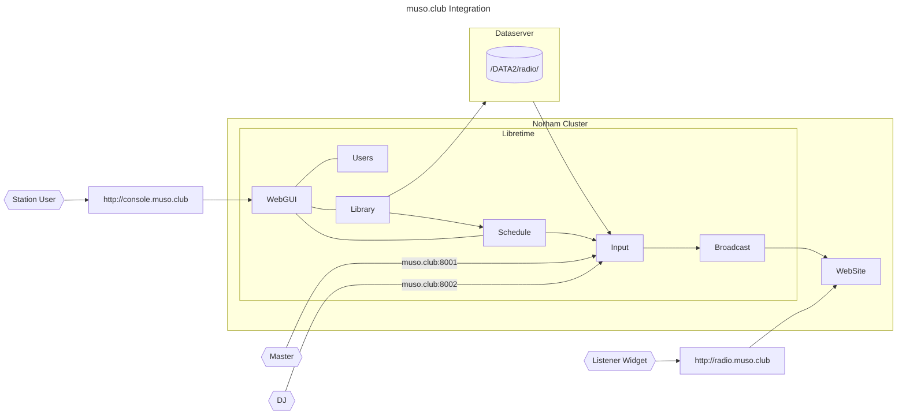

# Radio@Muso.Club Architecture

## High Level Design

For traceability, from requirements, we have the following MVP Themes

1. Icecast - Stream audio tracks from network file storage during a scheduled session
1. DJ - Schedule playlists of uploaded content for use in scheduled sessions
1. Radio - Stream in from icecast source for broadcast from a DJ installation during scheduled sessions
1. Listener - View Radio Station web page with embedded playback and listen to scheduled audio

These are to be implemented, using the LibreTime platform, as described in the following sections.

### 1: Icecast - Stream audio tracks from network file storage

Original content for featured artists are loaded onto the dataserver, on Data02, and streamed from the icecast instance on dataserver on a dedicated mount point per track. This results in a local URL that can be configured as a "Webstream" in Libretime. The Webstream can be added directly to a scheduled session, or added to a playlist, for use in a scheduled session.



The diagram depicts an icecast instance with icecast.paths.webroot set to */Data02/webcast*

### 2: DJ - Schedule playlists of uploaded content

Prerequisites:

- Admin: Create User on the radio console, with the role of DJ.
- Admin: Create Session on the radio console, and assign it to the created DJ.

Process:

- DJ selects "Upload" on radio console, and adds music or voice tracks
- DJ selects "Calendar", clicks on session, selects "Schedule Tracks"
- DJ drags tracks from track list from panel on the left, to the session slot in the right hand panel.

When the session starts, the selected tracks will be streamed in order.

### 3: Radio - Stream in for broadcast from a DJ installation

A DJ (or live audio stream) to connect to the station, using dedicated credentials, to the main mount point, during sessions scheduled for the DJ in the radio schedule. A number of Icecast clients have been tested successfully, illustrated as examples of the stream source.



### 4: Listener - View Radio Station web page with embedded playback and schedule

A Listener is the Actor using the radio broadcast service. The streaming protocol chosen is MP3 to support the broadest range of devices.



#### Default browser audio player

 If the radio station broadcast URL <https://broadcast.muso.club/main> is opened in a browser, the default behaviour is to display an audio player and start playing the broadcasted mp3 stream. This can be embedded in a website, or linked to from a QR code.

#### Radio station widget

LibreTime has an embeddable player that can be displayed on a web page in an iFrame. For <Radio@Muso.Club>, the following can be added to a custom HTML block:

```html
<iframe 
  frameborder="0"
  width="280"
  height="216"
  src="https://console.muso.club/embed/player?stream=auto&title=Now Playing"
></iframe>
```

### WordPress widget

The standard audio block for WordPress displays a simple audio player. This can be used to build a player widget that suites the web site.

### Styling the audio player element using js, html, and css

- Reference: <https://blog.shahednasser.com/how-to-style-an-audio-element/>

### Libretime API

As documented in <https://libretime.org/docs/user-manual/playout-history/>, the following API URLs return publicly accessible radio information, if enabled:

- <https://console.muso.club/api/live-info/?callback>
- <https://console.muso.club/api/week-info/?callback>

In general, for authenticated APIs, the URL is of the form <https://console.muso.club/api/api-action/format/json/api_key/XXXXXX>

Valid API actions:

- on-air-light - return true if the station is on air
- status - get the status of LibreTime components and resource usage
- version - returns the version of LibreTime installed
- get-files-without-silan-value - list files for which silence detection hasn't yet been performed
- get-stream-setting - gets the settings of LibreTime output streams
- get-stream-parameters - gets the parameters of LibreTime output streams

Tested:

- <https://console.muso.club/api/on-air-light/?callback>
- <https://console.muso.club/api/status/?callback> : Returns HTTP status code *200 OK*, with ContentLength=0.
- <https://console.muso.club/api/version/?callback> : Returns json with *airtime_version* and *api_version*.
- <https://console.muso.club/api/get-stream-setting/?callback> : Returns HTTP status code *200 OK*, with ContentLength=0.
- <https://console.muso.club/api/get-stream-parameters?callback>: Returns HTTP status code *200 OK*, with ContentLength=0.

For test purposes, expose the api service to localhost with a k8s port forward on port 9001

A version 2 API is also available. API documentation for the installation is available on the following URL: <https://console.muso.club/api/v2/schema/swagger-ui>

## Technical Implementation

- Build a custom LibreTime chart, to match infrastructure ingress and storage class, and db StatefulSet.
- Create Flux apps/radio.muso.club kustomization with LibreTime source, and override values.
- Create Flux infrastructure/ingress-nginx kustomization to add TCP ports
- Create Flux apps/www.radio.muso.club kustomization with WordPress source, and override values.

## POV Prep, and fixes from POC

- Domain purchased for POV: muso.club
- Build libretime chart, revised to remove non http ingress
- Deploy to norham cluster, using flux, with values override
- Configure ingress-nginx: deploy as chart, with values file for TCP ingress
- Configure db *StatefulSet* instead of *Deployment*

## Post installation configuration

### Libretime

- log in as admin:admin
- Set admin password
- Set Station logo, Name and Description
- Get player and schedule widget html for web site home page
- NOTE: Do not set Settings->Streams->Live Broadcast->Auto Switch Off/On until understood.

### Wordpress

- log in as musoclub
- install and run Wordpress importer with latest export
- add image files to library
- edit pages and posts to replace missing images
- edit page header libretime player widget (if necessary)
- edit main page libretime schedule widget (if necessary)

### Track Ingestion

- Host: dataserver
- Access controlled Samba on local network for workstation access.
- Samba writeable raw library directory: `/Data01/cdcollection`
- Samba writeable ingestion directory: `/Data02/library-in`
- Process: copy albums from `/Data01/cdcollection` to `/Data02/library-in`
- Batch process, with clean-up, to `/Data02/library`
- NFS access to `/Data02/library` for station batch upload
- NFS access to `/Data02/radio` for station media `/srv/libretime`
- To be backed backed up in sync with station DB: `/srv/libretime`

#### Ingestion notes

**Clean-up tool: Beets**

Process:

- Use fre:ac for cd to `/cdcollection/`
- `ffmpeg -i filename.mpg` for metadata view
- Copy batches of directories from `/cdcollection/` to `/library-in/`
- Run `beet import .` in `/library-in/`, and follow interactive process
- Images and other non-music files cleaned up periodically from /library-in

Results:

- /cdcollection: 17G
- library: 15G
- library-fallout: 323M

Beet config:

```conf
directory: /Data02/library/
library: /Data02/librarydb/musiclibrary.db
import:
    move: yes
```
Fallout:

```txt
63M	./various artists - the bossa nova exciting jazz samba rhythms vol.1
4.8M	./1982 - beyond the realms of dub_dub me crazy pt.2
48M	./Beasty Boys - Hello Nasty
8.3M	./aphex twin
60M	./blade runner - soundtrack
32M	./caves of kiev
110M	./electronica
323M	.
```

## Backup and Restore

### Station Database

- [X] Reference: <https://libretime.org/docs/admin-manual/backup/>
- [X] DB front-end Adminer: <https://db.muso.club/current/site?pgsql=postgres&username=libretime&db=libretime>
- [X] Password: available by base64 decoding `radio/postgres-secret.data.POSTGRES_PASSWORD`
- [X] Test export of station db run at 1am on 30th May - `libretime.sql.gz` - is 14.2MB.
- [ ] Test export after at least a few day's station run to get a picture of data growth.
- [ ] Test import into new station
- [ ] Test import to override current station

### Media

- [ ] Station NFS datastore
- [ ] Station Library

## Technical Architecture

### Integration



### Request routing


## Icecast config for webstreams

The following are available **on the local network**. The base URL is <http://192.168.1.26:8000>, so for the mount example below, the URL is <http://192.168.1.26:8000/Artist/Track.mp3>.

```xml
<mount type="normal">
    <mount-name>/Artist/Track.mp3</mount-name>
    <type>application/mp3</type>
    <fallback-mount>/Artist/Track.mp3</fallback-mount>
</mount>
```

This configuration is applied to the icecast instance on *dataserver*.

## POV URLS

- Wordpress site: <https://radio.muso.club>
- Radio Station console: <https://console.muso.club>
- Icecast Server console: <https://broadcast.muso.club>
- DJ Ingress: muso.club:8001
- Master Ingress: muso.club:8002

## POC URLS

- Wordpress site: <https://www.radio.thruhere.net>
- Radio Station console: <https://console.thruhere.net>
- Icecast Server console: <https://radio.thruhere.net>
- DJ Ingress: <https://dj.radio.thruhere.net/>
- Master Ingress: <https://master.radio.thruhere.net/>

### Applying Ingress modifications for playout TCP ports

To support non-HTTP TCP listener ports on the cluster, the cluster ingress-nginx installation is moved from a helm install at cluster build time, to a gitops installation. The following ingress-nginx chart values setting are used:

```conf
## ingress-nginx helm chart values to add support for radio ingress 
controller:
  configAnnotations:
    nginx.ingress.kubernetes.io/proxy-body-size: 20m
  service:
    ports:
      djinput: 8001
      masterinput: 8002
tcp:
  8001: "radio/liquidsoap:8001"
  8002: "radio/liquidsoap:8002"
```

Here, there are two additional listener ports being added to the ingress-nginx controller, and corresponding entries added to a tcp-services configmap, as documented here: <https://github.com/kubernetes/ingress-nginx/blob/main/docs/user-guide/exposing-tcp-udp-services.md>.

Using a gitops installation for ingress-nginx also allows the file upload limit to be increased from the default easily, which is required by Libretime as well as WordPress.
