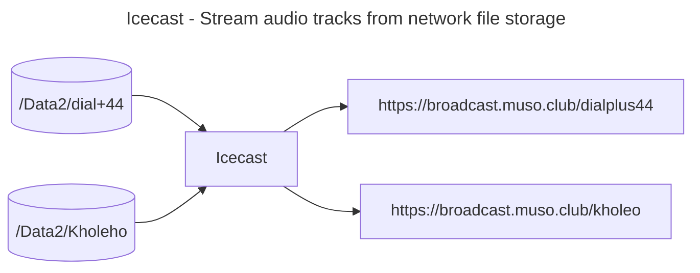
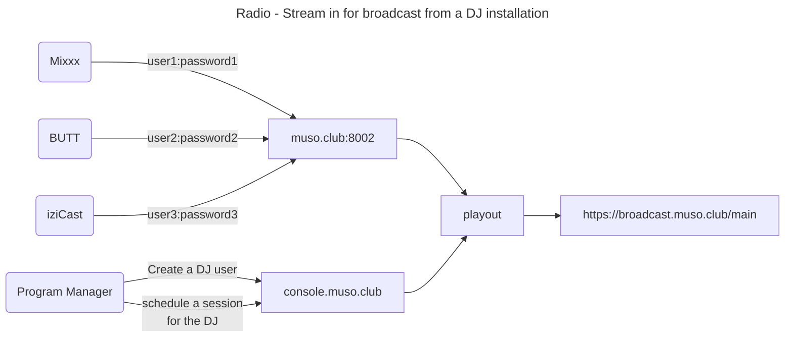
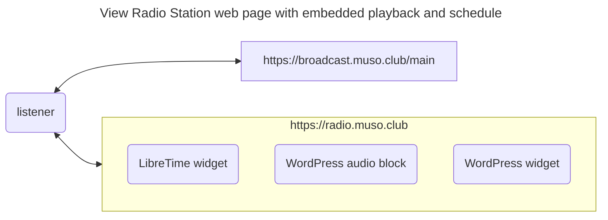
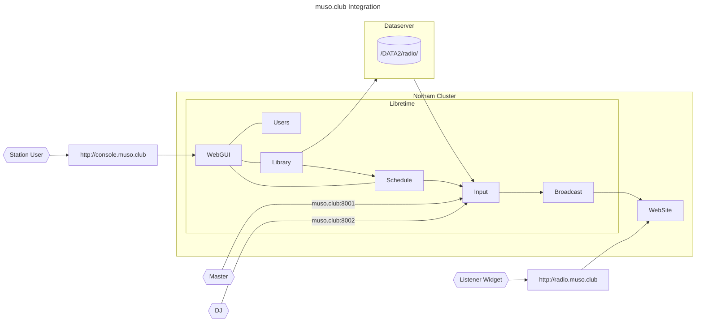

# Radio@Muso.Club Architecture

## High Level Design

For traceability, from requirements, we have the following MVP Themes

1. Icecast - Stream audio tracks from network file storage
1. DJ - Schedule playlists of uploaded content
1. Radio - Stream in from icecast source for broadcast from a DJ installation
1. Listener - View Radio Station web page with embedded playback and schedule

These are to be implemented, using the LibreTime platform, as described in the following sections.

### 1: Icecast - Stream audio tracks from network file storage

Original content for featured artists loaded onto nfs://Data2/ to be streamed out continuously on a dedicated mount point.



### 2: DJ - Schedule playlists of uploaded content

Prerequisites:

- Admin: Create User on the radio console, with the role of DJ.
- Admin: Create Session on the radio console, and assign it to the created DJ.

Process:

- DJ selects "Upload" on radio console, and adds music or voice tracks
- DJ selects "Calendar", clicks on session, selects "Schedule Tracks"
- DJ drags tracks from track list from panel on the left, to the session slot in the right hand panel.

When the session starts, the selected tracks will be streamed in order.

### 3: Radio - Stream in for broadcast from a DJ installation

A DJ (or live audio stream) to connect to the station, using dedicated credentials, to the main mount point, during sessions scheduled for the DJ in the radio schedule. A number of Icecast clients have been tested successfully, illustrated as examples of the stream source.



### 4: Listener - View Radio Station web page with embedded playback and schedule

A Listener is the Actor using the radio broadcast service. The streaming protocol chosen is MP3 to support the broadest range of devices.



#### Default browser audio player

 If the radio station broadcast URL <https://broadcast.muso.club/main> is opened in a browser, the default behaviour is to display an audio player and start playing the broadcasted mp3 stream. This can be embedded in a website, or linked to from a QR code.

#### Radio station widget

LibreTime has an embeddable player that can be displayed on a web page in an iFrame. For <Radio@Muso.Club>, the following can be added to a custom HTML block:

```html
<iframe 
  frameborder="0"
  width="280"
  height="216"
  src="https://console.muso.club/embed/player?stream=auto&title=Now Playing"
></iframe>
```

### WordPress widget

The standard audio block for WordPress displays a simple audio player. This can be used to build a player widget that suites the web site.

## Technical Implementation

- Build a custom LibreTime chart, to match infrastructure ingress and storage class, and db StatefulSet.
- Create Flux apps/radio.muso.club kustomization with LibreTime source, and override values.
- Create Flux infrastructure/ingress-nginx kustomization to add TCP ports
- Create Flux apps/www.radio.muso.club kustomization with WordPress source, and override values.

## POV Prep, and fixes from POC

- Domain purchased for POV: muso.club
- Build libretime chart, revised to remove non http ingress
- Deploy to norham cluster, using flux, with values override
- Configure ingress-nginx: deploy as chart, with values file for TCP ingress
- Configure db *StatefulSet* instead of *Deployment*

## Post installation configuration

### Libretime

- log in as admin:admin
- Set admin password
- Set Station logo, Name and Description
- Get player and schedule widget html for web site home page
- NOTE: Do not set Settings->Streams->Live Broadcast->Auto Switch Off/On until understood.

### Wordpress

- log in as musoclub
- install and run Wordpress importer with latest export
- add image files to library
- edit pages and posts to replace missing images
- edit page header libretime player widget (if necessary)
- edit main page libretime schedule widget (if necessary)

## Technical Architecture

### Integration



### Request routing


## POV URLS

- Wordpress site: <https://radio.muso.club>
- Radio Station console: <https://console.muso.club>
- Icecast Server console: <https://broadcast.muso.club>
- DJ Ingress: muso.club:8001
- Master Ingress: muso.club:8002

## POC URLS

- Wordpress site: <https://www.radio.thruhere.net>
- Radio Station console: <https://console.thruhere.net>
- Icecast Server console: <https://radio.thruhere.net>
- DJ Ingress: <https://dj.radio.thruhere.net/>
- Master Ingress: <https://master.radio.thruhere.net/>

### Applying Ingress modifications for playout TCP ports

- `~/workspace/admin/working$ kubectl apply -f tcp-services-configmap.yaml`
- edit *ingress-nginx-ingress-nginx-controller*: `    - --tcp-services-configmap=ingress-nginx/tcp-services`
