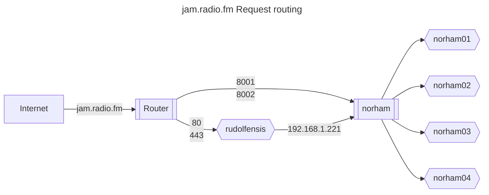
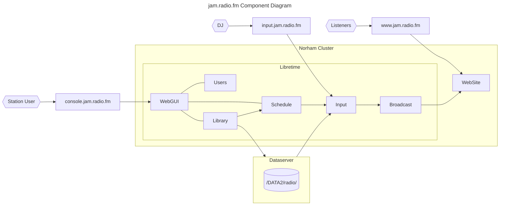

# Jam Radio FM Architecture

## POV

- Domain purchased for POV: jam.radio.fm
- Build libretime chart, revised to remove non http ingress
- Deploy to norham cluster, using flux, with values override

## Post installation configuration

### Libretime

- log in as admin:admin
- Set admin password
- Set Station logo
- Get player and schedule widget html for web site home page

### Ingress modifications

- `~/workspace/admin/working$ kubectl apply -f tcp-services-configmap.yaml`
- edit *ingress-nginx-ingress-nginx-controller*: `    - --tcp-services-configmap=ingress-nginx/tcp-services`

## Technical Architecture

## POV URLS

- Wordpress site: <https://www.jam.radio.fm>
- Radio Station console: <https://console.jam.radio.fm>
- Icecast Server console: <https://broadcast.jam.radio.fm>
- DJ Ingress: input.radio.thruhere.net:8001
- Master Ingress: input.radio.thruhere.net:8002

## POC URLS

- Wordpress site: <https://www.radio.thruhere.net>
- Radio Station console: <https://console.thruhere.net>
- Icecast Server console: <https://radio.thruhere.net>
- DJ Ingress: <https://dj.radio.thruhere.net/>
- Master Ingress: <https://master.radio.thruhere.net/>
