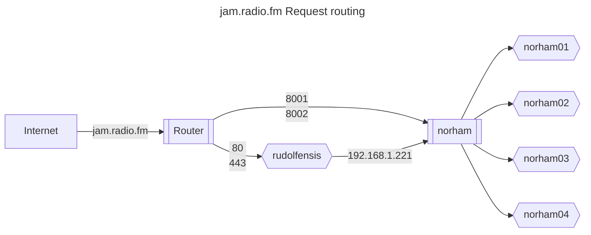
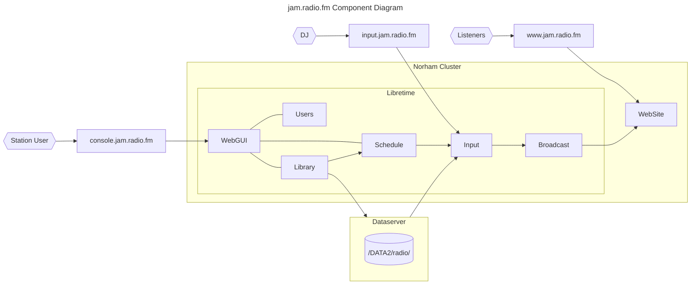

# ThruHere Community Radio

## Technical Architecture






## POV URLS

- Wordpress site: <https://www.jam.radio.fm>
- Radio Station console: <https://console.jam.radio.fm>
- Icecast Server console: <https://broadcast.jam.radio.fm>
- DJ Ingress: input.radio.thruhere.net:8001
- Master Ingress: input.radio.thruhere.net:8002

## POC URLS

- Wordpress site: <https://www.radio.thruhere.net>
- Radio Station console: <https://console.thruhere.net>
- Icecast Server console: <https://radio.thruhere.net>
- DJ Ingress: <https://dj.radio.thruhere.net/>
- Master Ingress: <https://master.radio.thruhere.net/>

## Tasklist

### Station Build

- [X] Library: 12" Vinyl {clean,sort}
- [X] Library: 7" Vinyl {clean,sort}
- [X] Turntables
- [X] Mixer
- [X] Microphone
- [ ] Microphone cable
- [X] Audio Interface
- [X] Hardware: k8s cluster dev (devcluster)
- [X] Hardware: k8s cluster prod (norham)
- [X] Installation: Admin tools {kubectl,k8s}
- [X] Installation: DJ Tools: butt
- [X] Installation: DJ Tools: mixxx

### System Build

- [X] Flex radio system definition
- [X] Ingress for Radio Console
- [ ] Ingress for Media Upload
- [X] Ingress for Radio Listener
- [ ] Ingress for DJ client streaming {non-http}
- [ ] Configuration: ogg -> mp3 stream
- [ ] Media kit
- [ ] Site Copy
- [ ] Bio Template
- [ ] About Us
- [ ] Build: Backup and restore
- [ ] Email address and Social Media accounts
- [ ] Security: override chart default passwords

### Test

- [X] Test: On-premise DJ streaming session from BUTT
- [ ] Test: On-premise DJ streaming session from MIXXX
- [ ] Test: On-premise JD streaming during session slot
- [ ] Test: Volume off-premise listening
- [ ] Test: Off-premise DJ streaming
- [ ] Backup and restore testing
- [X] Test: On premise audio file upload
- [X] Test: DJ Creation
- [X] Test: Playlist creation
- [X] Test: Session (repeat) creation
- [X] Test: On-premise listening
- [X] Test: Off-premise listening
- [X] Test: Mac browser listening
- [ ] Test: Windows browser listening

### Management

- [ ] Creative Brief for site structure, branding and content
- [ ] Domain and iconography specification
- [ ] Role Player: DJs
- [ ] Role Player: Technical Administrator
- [ ] Role Player: Field Support
- [ ] Role Player: Administrators {users, backups,tech support}
- [ ] Role Player: Program Managers
- [ ] Role Player: DJ Onboarding {djclient,bio,branding}
- [ ] Role Player: Radio Site Management
- [ ] Role Player: Program Managers
- [ ] Role Player: Campaign Manager
- [ ] Role Player: Sponsor

### Paperwork

- [ ] DJ, Artist consent process
- [ ] DJ Onboarding process
- [ ] Station Scheduling process
- [ ] Broadcast Licencing commitments
- [ ] Collaborator agreements
- [ ] Radio Directory listings
- [ ] Site maintenance: DJ and Artist Bios

## Ingress for Master and DJ

```yaml
apiVersion: v1
kind: ConfigMap
metadata:
  name: tcp-services
  namespace: ingress-nginx
data:
  8001: "radio/liquidsoap:8001"
  8002: "radio/liquidsoap:8002"
```

### Example

```text
The next example shows how to expose the service example-go running in the namespace default in the port 8080 using the port 9000
```

```yaml
apiVersion: v1
kind: ConfigMap
metadata:
  name: tcp-services
  namespace: ingress-nginx
data:
  9000: "default/example-go:8080"
```

```Then, the config map should be added to the ingress controller’s deployment args.

args:
    - /nginx-ingress-controller
    - --tcp-services-configmap=ingress-nginx/tcp-services
```

## References

- <https://kubernetes.github.io/ingress-nginx/user-guide/exposing-tcp-udp-services/>
- <https://docs.nginx.com/nginx-ingress-controller/configuration/global-configuration/command-line-arguments/>
