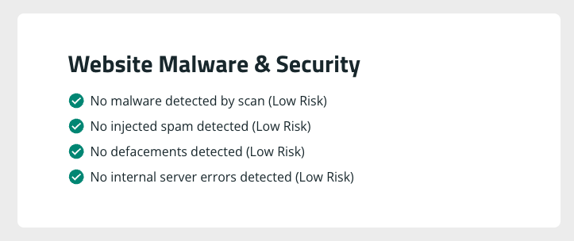
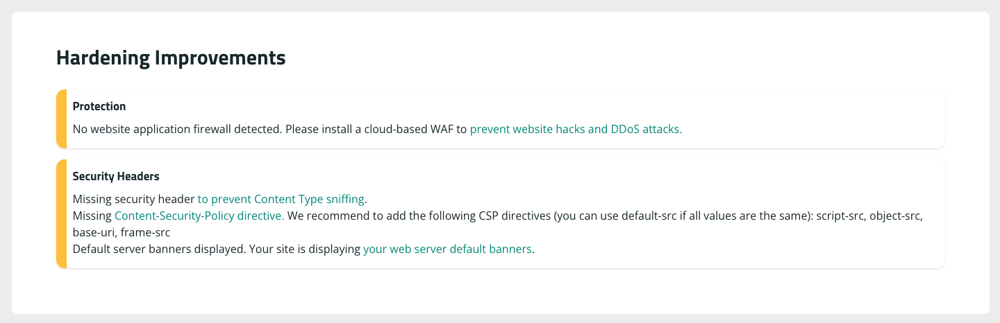
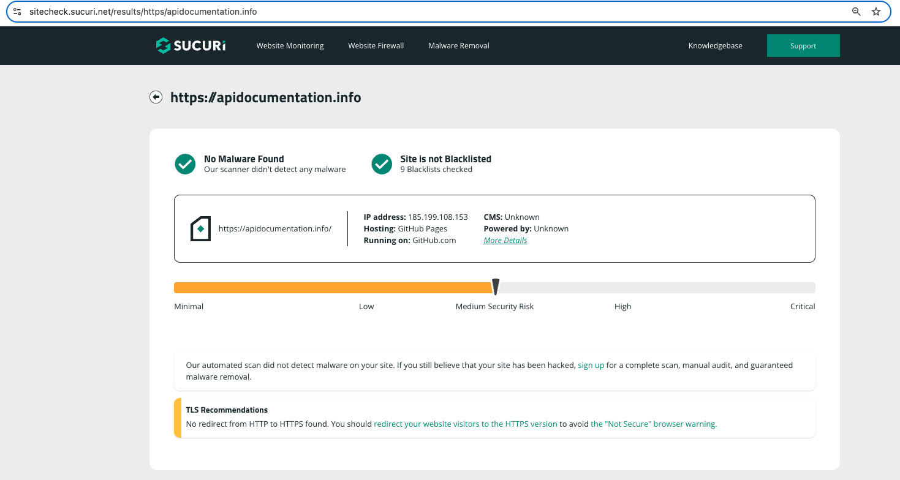

# Security

## Tasks

- [X] Hardening at static-site to be applied also at gateway reverse-proxy
- [X] Additional headers for best practice security at gateway, and next static-site release
- [X] Install WAF: ModSecurity on gateway
- [X] Configure WAF
- [ ] Install OWASP rule-set: Need to be ready with exclusions for existing workload 

## CORS

API and Swagger UI are deployed on different hosts. Apache (OHS) configuration addition:

```conf
<IfModule mod_headers.c>
  Header set Access-Control-Allow-Origin "*"
</IfModule>
```

Browser still refuses Swagger UI calls to API.

### Disabling browser CORS security failures:

For Brave, on MacOS:

`open -n -a /Applications/Brave\ Browser.app/Contents/MacOS/Brave\ Browser --args --user-data-dir="/tmp/brave_dev_sess_1" --disable-web-security`

For Chrome, on MacOS:

`open /Applications/Google\ Chrome.app --args --user-data-dir="/var/tmp/Chrome dev session" --disable-web-security`

## WAF

- SQL Injection Test: `https://apidocumentation.info/?id=3 or 'a'='a'`
- <https://sitecheck.sucuri.net/results/https/apidocumentation.info>

### Before Adjustments: Bladon cluster

- `https://apidocumentation.info/?id=3%20or%20%27a%27=%27a%27`: Same page returned as without parameter. Status 304 unmodified, instead of 200.
- Securicheck Before:







### After adjustments

- `https://apidocumentation.info/?id=3 or 'a'='a'`: 403 Forbidden - so WAF active.
- NOTE: WAF disabled, as other apps (specifically Nextcloud) need specific configurations to work.


### Before Adjustments: GitHub

Adjust DNS to Github:


Results:




## LibModSecurity

- `sudo apt install libapache2-mod-security2`
- `sudo a2enmod security2`
- `sudo a2enmod headers`

## Headers

1. Hardening at static-site to be applied also at gateway reverse-proxy

```conf
ServerSignature Off
ServerTokens Prod
Header set X-Content-Type-Options nosniff
# Header set X-XSS-Protection "1; mode=block"
Header always append X-Frame-Options SAMEORIGIN
Header always set Content-Security-Policy "default-src 'self';"
```

- `apachectl configtest`
- `sudo systemctl restart apache2.service`

Breaks Swagger UI. URLs blocked:

- <https://cdnjs.cloudflare.com/ajax/libs/highlight.js/11.8.0/highlight.min.js>
- https://cdnjs.cloudflare.com/ajax/libs/highlight.js/11.8.0/styles/github.min.css

- Reason, exception: <https://gist.github.com/m-lukas/5bbf98e0dbade2d9f9428956512bdd31>
- Swagger-UI Issue: <https://github.com/swagger-api/swagger-ui/issues/7540>

No set of headers was found to work:

```conf
#Header always set Content-Security-Policy "default-src 'self';"
#Header always set Content-Security-Policy "default-src 'self'; script-src 'self' https://cdnjs.cloudflare.com/ajax/libs/highlight.js/11.8.0/highlight.min.js; style-src 'self' https://cdnjs.cloudflare.com/ajax/libs/highlight.js/11.8.0/styles/github.min.css; frame-ancestors 'none'"
#Header always set Content-Security-Policy "default-src 'self'; script-src 'self' https://cdnjs.cloudflare.com/ajax/libs/highlight.js/11.8.0/highlight.min.js 'sha256-Vc0+zXX2dXmJfUC7ZTsM4pK30Mvqh8nEp/S/X069w4o='; style-src 'self' https://cdnjs.cloudflare.com/ajax/libs/highlight.js/11.8.0/styles/github.min.css; frame-ancestors 'none'"
#Header always set Content-Security-Policy "default-src 'self' https://cdnjs.cloudflare.com unsafe-inline;"
#Header always set Content-Security-Policy "default-src 'self'; script-src 'self' https://cdnjs.cloudflare.com/; style-src 'self' https://cdnjs.cloudflare.com/; frame-ancestors 'none'"
#Header always set Content-Security-Policy  "default-src 'self'; script-src 'self' https://cdnjs.cloudflare.com/ unsafe-inline; style-src 'self' https://cdnjs.cloudflare.com/; frame-ancestors 'none'"
#Header always set Content-Security-Policy  "default-src 'self'; script-src 'self' https://cdnjs.cloudflare.com/ unsafe-inline; style-src 'self' https://cdnjs.cloudflare.com/"
#Header always set Content-Security-Policy  "default-src 'self'; script-src 'self' https://cdnjs.cloudflare.com/ unsafe-inline data:; style-src 'self' https://cdnjs.cloudflare.com/"
#Header always set Content-Security-Policy  "default-src 'self' data:; script-src 'self' https://cdnjs.cloudflare.com/ unsafe-inline; style-src 'self' https://cdnjs.cloudflare.com/"
#Header always set Content-Security-Policy  "default-src 'self' data:; script-src 'self' data: https://cdnjs.cloudflare.com/ unsafe-inline; style-src 'self'  data: https://cdnjs.cloudflare.com/"
#Header always set Content-Security-Policy  "default-src 'self' data:; script-src 'self'  data: https://cdnjs.cloudflare.com/ unsafe-inline unsafe-eval; style-src 'self'  data: https://cdnjs.cloudflare.com/"
```

### Generating a sha256 key for an embedded script

One of the options for Content-Security-Policy is to allow only embedded scripts with sha-keys declared in the security policy, the alternative being the 'unsafe-inline' option, allowing all embedded scripts to be served. Unfortunately the generated files using the mkdocs theme, and swagger-ui have many such scripts, and they potentially change on each build. This would require make adding security exceptions at build time...

In any case, for example, the key for the following *script* section of a generated html files is 'sha256-Vc0+zXX2dXmJfUC7ZTsM4pK30Mvqh8nEp/S/X069w4o=', illustrating the method:

```bash
cat <<EOF > script.html
html
    window.onload = function () {
      window.ui = SwaggerUIBundle({
.
.
.
      }
    }
EOF
```

- The key is created as follows: `openssl sha256 -binary script.html | openssl base64`

### Adding CDN hosted js and css libraries

Adding *script-src* and *style-src* exceptions to the policy:

```conf
Header always set Content-Security-Policy  "default-src 'self' data:; script-src 'self' https://cdnjs.cloudflare.com/ unsafe-inline; style-src 'self' https://cdnjs.cloudflare.com/"
```

## static-site

Static-site is a helm Chart with an hardened Apache server set up specifically (and only) to serve static http sites. It also has git-sync set up to pull changes from a repo, and support for ssl certificate management.

Hardening includes the following:

- Only request types required for static site access are allowed
- Indexes not generated where index.html file does not exist
- Prevent server detail leakages
- Enable request time-out to prevent slow request denial of service
- Set headers for best practice security:

```conf
ServerTokens Prod
ServerSignature Off
FileETag None
TraceEnable off
Header edit Set-Cookie ^(.*)$ $1;HttpOnly;Secure
Header always append X-Frame-Options SAMEORIGIN
Header set X-XSS-Protection "1; mode=block"
Timeout 60
```

- Full httpd.conf: <https://github.com/MoTTTT/static-site/blob/main/static-site/files/httpd.conf>

For reference, Gateway headers:

```conf
ServerSignature Off
ServerTokens Prod
Header set X-Content-Type-Options nosniff
# Header set X-XSS-Protection "1; mode=block"
Header always append X-Frame-Options SAMEORIGIN
Header always set Content-Security-Policy "default-src 'self';"
```

NOTE: Select between *X-XSS-Protection* and *Content-Security-Policy*

## Proxmox (Cluster substrate hypervisor)

Hardening reference: - <https://gist.github.com/opentaq/a2084965616897d0d3b2cf832273ce07>

## References

- <https://medium.com/@maheshwar.ramkrushna/implementing-missing-security-headers-in-apache-web-server-9923acb044f1>
- <https://github.com/MoTTTT/static-site>
- <https://www.openappsec.io/post/top-10-free-wafs-web-application-firewalls-for-2024>
- <https://gist.github.com/opentaq/a2084965616897d0d3b2cf832273ce07>
- <https://swagger.io/docs/open-source-tools/swagger-ui/usage/cors/>
- <https://www.openappsec.io/post/top-10-free-wafs-web-application-firewalls-for-2024>
- <https://docs.openappsec.io/getting-started/start-with-linux>
- <https://coraza.io/docs/tutorials/introduction/>
- <https://www.zenarmor.com/docs/network-security-tutorials/best-open-source-web-application-firewalls>
- <https://medium.com/codelogicx/securing-apache-server-using-modsecurity-oswaf-d29664179a05>
- <https://github.com/owasp-modsecurity/ModSecurity>
- <https://www.linuxbabe.com/security/modsecurity-apache-debian-ubuntu>
- <https://apisix.apache.org/blog/2024/10/22/apisix-integrates-with-open-appsec/>
- <https://docs.openappsec.io/getting-started/start-with-docker>
- <https://github.com/highlightjs/highlight.js/wiki/security>

- <https://blog.sucuri.net/2023/12/what-is-content-security-policy.html>
- <https://stackoverflow.com/questions/9090577/what-is-the-http-header-x-xss-protection>
- <https://gist.github.com/m-lukas/5bbf98e0dbade2d9f9428956512bdd31>
- <https://cdnjs.cloudflare.com/>
- <https://content-security-policy.com/>
- <https://pypi.org/project/mkdocs-swagger-ui-tag/>
- <https://github.com/swagger-api/swagger-ui/issues/7540>
