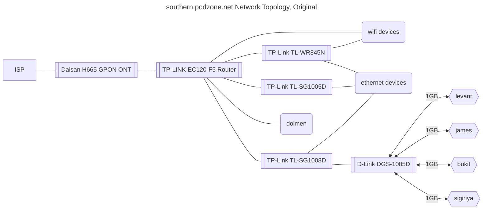

# Overflow and historical information on original zone

## Development Environment

Three personal machines and workstations were re-purposed to create a dev environment. Upgrades to disk and ram were done where possible. It would have been great to get RAM on all devices up to 16GB, or more, but unfortunately only one device accommodated upgrade, and that to only 16GB.

### sigiriya

- Late 2014 Mac Mini
- 2.80GHz i5-4308U (2 core, 4 thread)
- 8GB RAM (soldered)
- Ubuntu Server 22.04 (upgrade from macOS)
- 2TB SSD (upgrade from 500GB)
- eth0 IP: 192.168.0.6

### bukit

- Late 2014 Mac Mini
- 1.4 GHz Dual Core i5
- 4 GB RAM (soldered)
- Ubuntu 22.04 desktop (existing installation)
- 500GB SSD
- eth0 IP: 192.168.0.52
- admin user: martin

### james

- Motherboard: ASRock H61M-VS3
- 3 GHz Quad Core i5
- 16GB (upgrade from 8 GB) RAM
- Ubuntu 22.04 desktop (existing installation)
- 500 GB SSD
- eth0 IP: 192.168.0.27