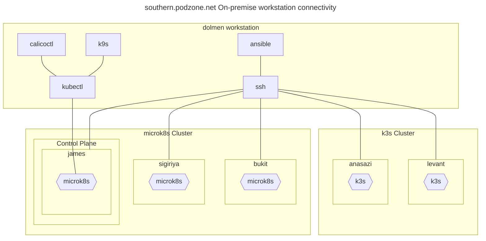

# Workstation config

The purpose of this page is to keep some track of software installations required for build, troubleshooting and administration of the solution. Some of the tools are described in the Tooling topic above, under *Administration*.

## Tooling

Tools installed on Dolmen for cluster build and management:

- ansible
- kubectl
- calicoctl
- k8s
- helm
- jq
- octant
- openssl
- vagrant

## Connectivity

## Hardware configuration

- MacBook Pro
- Apple M1
- 16GB RAM
- macOs Ventura 13.5.2
